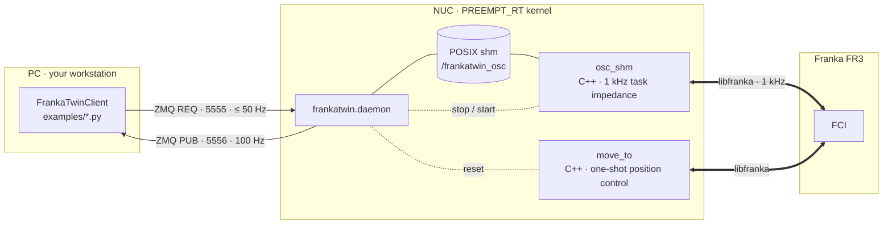

<p align="center">
  
</p>

<p align="center">
A 1 kHz task impedance controller for the <b>Franka Research 3 / Panda</b> whose
simulation twin is <i>the same controller</i> — plus the system identification that makes
the twin's dynamics match the real arm to within 1–3 % of joint motion range.
</p>

<p align="center">
  <a href="LICENSE"></a>
  
  
  
</p>

---

## Why FrankaTwin

Most Franka stacks give you a controller. FrankaTwin gives you a controller **and a
proof that the simulated arm behaves like the real one under it**:

- **Task impedance control, identical in sim and on the robot.** The controller
  is the task-space impedance law that sim-to-real work such as
  [IndustReal](https://arxiv.org/abs/2305.17110) and
  [OmniReset](https://weirdlabuw.github.io/omnireset/) trains policies on: a
  Cartesian PD wrench mapped through Jᵀ, no null-space term, no apparent-mass
  projection. `src/osc_shm.cpp` (libfranka, 1 kHz) and the IsaacLab controller
  in `isaaclab_sysid/` are the same law with the same gains, damping rule and
  torque slew limit, so a policy runs on the arm through the controller it was
  trained with.
- **System identification that closes the loop.** A CMA-ES fit of 29 parameters
  (per-joint armature, static / dynamic / viscous friction, motor delay) drives the
  sim replay of real excitation runs. Validated on a held-out chirp:
  **joint-position MSE 4.8 × 10⁻⁴ rad²**, per-joint RMSE 12–30 mrad, i.e. 1.9–8.3 %
  of each joint's motion range.
- **Small and auditable.** ~700 lines of C++ for the controller, ~900 lines of
  Python for the daemon/client, POSIX shared memory + ZMQ in between. No ROS.
- **Battle-tested safety.** Torque slew-rate limiter (kills the
  `controller_torque_discontinuity` reflex at setpoint jumps), controlled stop,
  configurable collision thresholds, payload compensation, automatic controller
  restart — each one traceable to a real incident in
  [docs/troubleshooting.md](docs/troubleshooting.md).

<p align="center">
  
  <br><sub>Held-out 6-DOF chirp: sim (orange) on real (blue), per joint. Target dashed.</sub>
</p>

## Architecture



Two controllers run on the NUC; the daemon serialises them (libfranka allows one
FCI session at a time):

- **`osc_shm`** — continuous control: a 1 kHz task impedance controller that
  tracks whatever EE target you stream to it. Used for policies, teleop, sysid.

  ```
  F = Kp (x_des − x) − Kd ẋ          Kd = 2√Kp unless overridden
  τ = Jᵀ F + C(q, q̇) q̇                per-joint |τ| ≤ τ_max, |dτ/dt| ≤ 800 N·m/s
  ```

- **`move_to`** — one-shot position control to a joint configuration or an EE
  pose. The trajectory is generated by libfranka (min-jerk in joint space,
  5th-order Cartesian profile for EE targets). Used for resets.

Shm layout, seqlock, safety chain and the reasoning behind each default:
[docs/architecture.md](docs/architecture.md).

## Quick start

<kbd>NUC</kbd> (real-time PC on the robot) — build the controller, start the daemon:

```bash
git clone https://github.com/tsrobcvai/frankatwin && cd frankatwin
cmake -S . -B build && cmake --build build -j      # libfranka + Eigen3 (+ Pinocchio for libfranka >= 0.14)
pip install -e .
python -m frankatwin.doctor                        # RT kernel, binaries, libfranka, FCI link
python -m frankatwin.daemon -v
```

<kbd>PC</kbd> (your workstation) — drive the arm:

```bash
pip install -e ".[analysis]" && vim config/robot.yaml   # network.nuc_host
python examples/move_to.py                              # reset to home (position control)
python examples/policy_loop.py                          # a 10 Hz policy on task impedance control
```

The full walkthrough — prerequisites, every command tagged <kbd>NUC</kbd> /
<kbd>PC</kbd> / <kbd>SIM</kbd>, the three scripts and their flags, the sysid loop,
and every exposed interface — is in [docs/quickstart.md](docs/quickstart.md).

## Documentation

| | |
|---|---|
| [Quick start](docs/quickstart.md) | Prerequisites, installation, basic control (`move_to.py`, `cart_impedance.py`, `policy_loop.py`), sysid in four commands, all interfaces |
| [Installation](docs/installation.md) | RT kernel / FCI prerequisites, libfranka ≥ 0.14 + Pinocchio, conda caveats, first run |
| [Usage](docs/usage.md) | The daemon, every script and flag, the Python client API, `robot.yaml` reference |
| [Architecture](docs/architecture.md) | Control law, shared-memory ABI, daemon behaviour, safety chain, timing |
| [System identification](docs/sysid.md) | The 29 parameters, CMA-ES, excitation design, workflow, reference results |
| [Data format](docs/data_format.md) | Run CSV, sidecar JSON, sim replay CSV, `sysid_best_params.json` |
| [Troubleshooting](docs/troubleshooting.md) | Every reflex / build / payload / sysid failure we hit, and where its fix lives |

Build the site locally with `pip install -e ".[docs]" && sphinx-autobuild docs docs/_build/html`
(Sphinx, PyData theme; also generates the API reference from docstrings).

## Results

Parameters fitted on three multi-band runs, validated on a **held-out** 6-DOF chirp:

| metric (held-out chirp) | value |
|---|---|
| joint-position MSE | **4.8 × 10⁻⁴ rad²** (0.21× the training-set score) |
| per-joint RMSE | 12–30 mrad = 1.9–8.3 % of each joint's motion range |
| training runs, EE RMS | 41 mm → **8.4 mm**; joint RMS 983 → 25.5 mrad |

<p align="center">
  
  
</p>

Fitted parameters, per-joint tables and caveats: [docs/sysid.md → Reference results](docs/sysid.md#reference-results).

## Safety

FrankaTwin commands torques. Keep the user stop within reach, confirm FCI mode,
never run another FCI client at the same time, and read the safety chain in
[docs/architecture.md](docs/architecture.md#safety-chain) before running on hardware.

## Citing

```bibtex
@software{frankatwin2026,
  author  = {Sun, Tao and Yin, Patrick},
  title   = {FrankaTwin: a sim-to-real aligned 1 kHz task impedance controller for the Franka Research 3},
  year    = {2026},
  version = {0.2.0},
  url     = {https://github.com/tsrobcvai/frankatwin}
}
```

## Authors

- [**Tao Sun**](https://taosun99.github.io/) — McGill University
- [**Patrick Yin**](https://patrickyin.me/) — University of Washington

## License

Apache-2.0. Vendored code from libfranka (Apache-2.0) and Isaac Lab (BSD-3-Clause)
is listed in [THIRD_PARTY_NOTICES.md](THIRD_PARTY_NOTICES.md).
