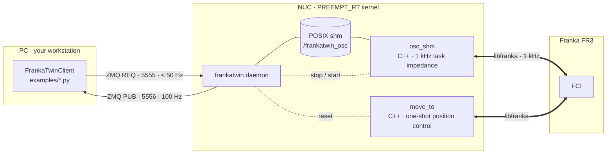

<h1 align="center">FrankaTwin</h1>

<p align="center">
A 1 kHz task impedance controller for the <b>Franka Research 3 / Panda</b> whose
simulation twin is <i>the same controller</i> — plus the system identification that makes
the twin's dynamics match the real arm to within 1–3 % of joint motion range.
</p>

<p align="center">
  <a href="LICENSE"></a>
  
  
  
</p>

---

## Why FrankaTwin

Most Franka stacks give you a controller. FrankaTwin gives you a controller **and a
proof that the simulated arm behaves like the real one under it**:

- **Task impedance control, identical in sim and on the robot.** The controller
  is the task-space impedance law that sim-to-real work such as
  [IndustReal](https://arxiv.org/abs/2305.17110) and
  [OmniReset](https://weirdlabuw.github.io/omnireset/) trains policies on: a
  Cartesian PD wrench mapped through Jᵀ, no null-space term, no apparent-mass
  projection. `src/osc_shm.cpp` (libfranka, 1 kHz) and the IsaacLab controller
  in `isaaclab_sysid/` are the same law with the same gains, damping rule and
  torque slew limit, so a policy runs on the arm through the controller it was
  trained with.
- **System identification that closes the loop.** A CMA-ES fit of 29 parameters
  (per-joint armature, static / dynamic / viscous friction, motor delay) drives the
  sim replay of real excitation runs. Validated on a held-out chirp:
  **joint-position MSE 4.8 × 10⁻⁴ rad²**, per-joint RMSE 12–30 mrad, i.e. 1.9–8.3 %
  of each joint's motion range.
- **Small and auditable.** ~700 lines of C++ for the controller, ~900 lines of
  Python for the daemon/client, POSIX shared memory + ZMQ in between. No ROS.
- **Battle-tested safety.** Torque slew-rate limiter (kills the
  `controller_torque_discontinuity` reflex at setpoint jumps), controlled stop,
  configurable collision thresholds, payload compensation, automatic controller
  restart — each one traceable to a real incident in
  [docs/troubleshooting.md](docs/troubleshooting.md).

<p align="center">
  
  <br><sub>Held-out 6-DOF chirp: sim (orange) on real (blue), per joint. Target dashed.</sub>
</p>

## Architecture



Two controllers run on the NUC; the daemon serialises them (libfranka allows one
FCI session at a time):

- **`osc_shm`** — continuous control: a 1 kHz task impedance controller that
  tracks whatever EE target you stream to it. Used for policies, teleop, sysid.

  ```
  F = Kp (x_des − x) − Kd ẋ          Kd = 2√Kp unless overridden
  τ = Jᵀ F + C(q, q̇) q̇                per-joint |τ| ≤ τ_max, |dτ/dt| ≤ 800 N·m/s
  ```

- **`move_to`** — one-shot position control to a joint configuration or an EE
  pose. The trajectory is generated by libfranka (min-jerk in joint space,
  5th-order Cartesian profile for EE targets). Used for resets.

Shm layout, seqlock, safety chain and the reasoning behind each default:
[docs/architecture.md](docs/architecture.md).

## Quick start

### 0. Prerequisites

Three machines can be involved. Every command below is tagged with where it runs:

| tag | machine | runs | software (tested) |
|---|---|---|---|
| — | **Robot** | — | Franka Research 3 (system ≥ 5.7) or Panda, Franka Hand attached, FCI enabled in Desk |
| <kbd>NUC</kbd> | real-time PC wired to the robot (FCI) | `python -m frankatwin.daemon` → `osc_shm` / `move_to` | Ubuntu 20.04 / 22.04 with `PREEMPT_RT` kernel · libfranka 0.13–0.15; ≥ 0.14 needs Pinocchio, handled by CMake · Eigen3, CMake ≥ 3.10 · Python ≥ 3.9 |
| <kbd>PC</kbd> | your workstation | `examples/*.py`, analysis scripts | Python ≥ 3.9 (numpy, pyyaml, pyzmq; pandas + matplotlib for the analysis scripts) |
| <kbd>SIM</kbd> | any GPU box with IsaacLab (can be the PC) | sysid fit, sim replay | IsaacLab 2.3.0 (≥ 2.3 for the dynamic/viscous joint-friction API) · `cmaes` |

Each step links to the full page in [docs/](docs/).

### 1. Installation

Full prerequisites (RT kernel, FCI, libfranka ≥ 0.14 + Pinocchio, conda caveats):
[docs/installation.md](docs/installation.md).

<kbd>NUC</kbd> build the 1 kHz controller, install the Python side, start the daemon

```bash
git clone https://github.com/tsrobcvai/frankatwin && cd frankatwin
cmake -S . -B build && cmake --build build -j      # libfranka + Eigen3 (+ Pinocchio for libfranka >= 0.14)
pip install -e .
python -m frankatwin.doctor        # RT kernel, rtprio, binaries, libfranka/pinocchio, FCI link, other FCI clients
python -m frankatwin.daemon        # binds 5555 (commands) / 5556 (state), launches osc_shm
```

<kbd>PC</kbd> Python only

```bash
git clone https://github.com/tsrobcvai/frankatwin && cd frankatwin
pip install -e ".[analysis]"          # analysis: pandas + matplotlib for the compare/plot scripts
vim config/robot.yaml                 # network.nuc_host = the NUC's address as seen from here
python -m frankatwin.doctor                     # daemon reachable? state stream flowing?
```

<kbd>SIM</kbd> only if you will run the sysid loop — see [step 3](#3-system-identification).

`config/robot.yaml` is shared by all sides (network, robot IP, gains, safety
clamps, collision thresholds, payload). Override with `--config` or
`$FRANKATWIN_CONFIG`.

### 2. Basic control

Four steps: bring the controller up on the NUC, then drive the arm from the PC
with three scripts (each takes `--config robot.yaml`; the two controllers they
use are described in [Architecture](#architecture)).

#### Step 1 · <kbd>NUC</kbd> Start the daemon

```bash
python -m frankatwin.daemon -v
```

It launches `osc_shm` — the arm now holds its current pose under impedance
control — and keeps it alive. Leave the terminal open; the banner should show
`RT = SCHED_FIFO`, `tau_rate = 800 Nm/s`, the payload and collision settings,
then `daemon ready`. All flags (`--config`, payload overrides), the banner line
by line, what it logs while running, how to stop it and when to restart it:
[docs/usage.md → Daemon](docs/usage.md#daemon-nuc).

#### Step 2 · <kbd>PC</kbd> Reset the arm — [`examples/move_to.py`](examples/move_to.py)

One-shot position control (`move_to`). Home by default; prints the pose
`osc_shm` holds afterwards.

```bash
python examples/move_to.py                                                # home = robot.init_q
python examples/move_to.py --target-joints 0 -0.785 0 -2.356 0 1.571 0.785 --speed 0.2
python examples/move_to.py --target-ee 0.4 0.0 0.3  0 1 0 0 --duration 5
```

| flag | meaning |
|---|---|
| `--target-joints J1 … J7` | 7 absolute joint angles [rad] |
| `--target-ee x y z qw qx qy qz` | EE position [m] in the robot **base frame** (+x forward, +z up) and orientation as a **unit quaternion, wxyz** — `0 1 0 0` = tool pointing down. EE frame = the one configured in Desk (Franka Hand: TCP between the fingertips) |
| `--speed` | joint move: speed factor (0, 0.5]; default `reset.joint_speed_factor` |
| `--duration` | EE move: seconds in [1.5, 20]; default `reset.pose_duration` |

#### Step 3 · <kbd>PC</kbd> Track a scripted reference — [`examples/cart_impedance.py`](examples/cart_impedance.py)

Continuous control (`osc_shm`) following a scripted EE reference at `--rate` Hz.
Logs a per-tick CSV + sidecar and prints tracking RMS and torque headroom. This
is also the sysid data collector.

```bash
python examples/cart_impedance.py                                         # sine: ±5 cm z at 0.5 Hz for 4 s
python examples/cart_impedance.py --mode chirp --kp-pos 500 --kp-ori 30 \
    --err-delta-pos 0.15 --err-delta-rot 0.80 --log data/run.csv        # sysid v4 chirp, logged
python examples/cart_impedance.py --mode multiband --dry-run              # build + check the reference, no robot
```

| flag | meaning |
|---|---|
| `--mode sine \| multiband \| chirp` | reference: z-sine (default), sysid v3 multi-band, sysid v4 chirp |
| `--kp-pos`, `--kp-ori` | impedance gains; default `control.*` in `robot.yaml` |
| `--err-delta-pos`, `--err-delta-rot` | `osc_shm` error clamps; the chirp needs `0.15` / `0.80` |
| `--rate`, `--duration` | loop rate [Hz] (50) and run time [s] (4 / 12 / 8 by mode) |
| `--amp`, `--freq` · `--amp-x/y/z`, `--amp-yaw`, `--amp-roll` · `--f0`, `--f1`, `--amp-rx/ry/rz` | reference shape for sine · multiband · chirp |
| `--log run.csv [--sidecar run.json]` | write the CSV + metadata ([format](docs/data_format.md)) |
| `--dry-run` | build the reference and print peak rates without a robot |

#### Step 4 · <kbd>PC</kbd> Run a policy closed-loop — [`examples/policy_loop.py`](examples/policy_loop.py)

Continuous control driven by a policy at a fixed rate. Ships with a stand-in
policy that moves the EE up 10 cm and back down every 4 s for 16 s; swap in
your network.

```bash
python examples/policy_loop.py                          # demo policy, 10 Hz, 16 s
python examples/policy_loop.py --hz 20 --pos-scale 0.0025 --no-reset
```

| flag | meaning |
|---|---|
| `--hz`, `--duration` | policy rate [Hz] (10) and run time [s] (16) |
| `--pos-scale`, `--rot-scale` | action → Δpos [m/step] (0.005) and Δrot [rad/step] (0.02) |
| `--kp-pos`, `--kp-ori`, `--err-delta-pos`, `--err-delta-rot` | impedance gains (500 / 30) and clamps (0.15 / 0.80) |
| `--no-reset` | skip the initial `move_to` home |

The whole loop — the pattern every closed-loop rollout uses:

```python
def demo_policy(t, obs):                      # stand-in for a network; 6-D action in [-1, 1]
    a = np.zeros(6)                           # a[0:3] = Δxyz, a[3:6] = Δrot (axis-angle), base frame
    a[2] = 1.0 if t % 4.0 < 2.0 else -1.0     # up for 2 s, down for 2 s: 10 cm at 0.005 m/step, 10 Hz
    return a

with FrankaTwinClient(cfg) as robot:
    robot.move_to_q(cfg.robot.init_q)                         # 1. position control: reset to home
    robot.set_gains(kp_pos=500, kp_ori=30,                    # 2. impedance gains (Kd = 2*sqrt(Kp));
                    error_delta_pos=0.15, error_delta_rot=0.80)   #    clamp > one step, so it never engages
    s = robot.wait_for_state()
    t0 = time.monotonic()
    for k in range(int(16 * 10)):                             # 3. 16 s at 10 Hz
        obs = np.concatenate([s.q, s.dq, s.ee_pos, s.ee_quat, s.ee_linvel, s.ee_angvel])
        a = np.clip(demo_policy(k / 10, obs), -1, 1)
        pos  = s.ee_pos + 0.005 * a[:3]                       # 4. Δ on the measured pose (as in the sim task)
        quat = mul_wxyz(from_rotvec_wxyz(0.02 * a[3:]), s.ee_quat)
        robot.set_ee_target(pos, quat)                        # 5. non-blocking; osc_shm holds it at 1 kHz
        time.sleep(max(0.0, t0 + (k + 1) / 10 - time.monotonic()))   # 6. fixed-rate tick
        s = robot.get_state()                                 # 7. newest frame of the 100 Hz stream
```

Between two policy steps `osc_shm` applies `τ = Jᵀ[Kp e − Kd ẋ]` a hundred times
to the held target (zero-order hold); the IsaacLab replay reproduces exactly that
staircase, which is why the sysid transfers. `error_delta_pos` is set above the
largest single step so the controller never clips — the sim's task impedance has
no clip either. Targets are absolute poses in the base frame, quaternions
**wxyz**; gains and clamps persist across `move_to` and controller restarts.
Control law, safety chain and timing: [docs/architecture.md](docs/architecture.md);
every client method and config key: [docs/usage.md](docs/usage.md).

### 3. System identification

From a real excitation run to a PhysX arm that tracks it, in four commands.
Excitation design, parameter bounds and the loss: [docs/sysid.md](docs/sysid.md).

<kbd>PC</kbd> excite the real arm with a 6-DOF chirp, log at 50 Hz

```bash
python examples/cart_impedance.py --mode chirp --kp-pos 500 --kp-ori 30 \
    --err-delta-pos 0.15 --err-delta-rot 0.80 --log data/chirp_$(date +%Y%m%d_%H%M%S).csv
```

<kbd>SIM</kbd> deploy the IsaacLab extension once, fit 29 parameters with CMA-ES, replay with them

```bash
./isaaclab_sysid/install_into_isaaclab.sh /path/to/IsaacLab && pip install cmaes   # once
cd /path/to/IsaacLab
python scripts/tools/sysid_franka_osc.py --headless --num_envs 128 --max_iter 40 \
    --real_csv /path/to/chirp.csv --real_sidecar /path/to/chirp.json
python scripts/tools/apply_sysid_params.py --best logs/sysid_franka/<ts>/sysid_best_params.json \
    --invoke-replay --real-csv /path/to/chirp.csv --real-sidecar /path/to/chirp.json   # -> chirp_sim_sysid.csv
```

<kbd>PC</kbd> overlay real vs sim

```bash
python scripts/compare_sim_real.py --real-csv chirp.csv --sim-csv chirp_sim_sysid.csv --save
```

The fitted `sysid_best_params.json` drops into any IsaacLab Franka task via
`apply_sysid_params.py --print-snippet` (actuator armature / friction / delay
overrides). Results on our arm are in [Results](#results).

### 4. Interfaces

Everything you can talk to, from highest to lowest level:

| interface | where | what | reference |
|---|---|---|---|
| **Scripts** | <kbd>NUC</kbd> `python -m frankatwin.daemon`, `python -m frankatwin.doctor` · <kbd>PC</kbd> `examples/move_to.py`, `examples/cart_impedance.py`, `examples/policy_loop.py`, `scripts/gen_*_traj.py`, `scripts/compare_sim_real.py`, `scripts/check_torque_limits.py`, `python -m frankatwin.doctor` | plain Python files, one job each; read them | [usage.md → Scripts](docs/usage.md#scripts) |
| **Python client** `FrankaTwinClient` | <kbd>PC</kbd> | `set_ee_target(pos, quat_wxyz)`, `set_gains(kp_pos, kp_ori, kd_pos, kd_ori, error_delta_pos, error_delta_rot)`, `enable()` / `disable()`, `get_state(fresh=False)`, `get_state_history()`, `wait_for_state()`, `move_to_q(q, speed_factor)`, `move_to_pose(pos, quat, duration)` | [usage.md → Client API](docs/usage.md#client-api-pc) |
| **`LocalController`** | <kbd>NUC</kbd> | same methods as the client, in-process (no ZMQ) | [usage.md → Client API](docs/usage.md#client-api-pc) |
| **`RobotState`** | both | `timestamp_s, q[7], dq[7], ee_pos[3], ee_quat[4] (wxyz), ee_linvel[3], ee_angvel[3], tau[7]` (commanded), `tau_J[7]` (measured, gravity incl.), `seq` | [usage.md](docs/usage.md#client-api-pc) |
| **Daemon protocol** (any language) | <kbd>PC</kbd> → <kbd>NUC</kbd> | JSON over ZMQ. REQ/REP on `cmd_port`: `{"op": "ping" \| "set_ee_target" \| "set_gains" \| "enable" \| "disable" \| "get_state" \| "move_to_q" \| "move_to_pose" \| "shutdown", ...}` → `{"ok": true, ...}`; PUB on `state_port`: one `RobotState` JSON at 100 Hz | [architecture.md → Daemon](docs/architecture.md#daemon-behaviour) |
| **Shared memory** (any language) | <kbd>NUC</kbd> | `/frankatwin_osc`: `ShmCommand` (seqlock: target, gains, clamps, enabled) and a 1024-frame `ShmStateFrame` ring at 1 kHz. Fixed ABI in `src/shm_layout.h` / `frankatwin.shm_layout`, pinned by `tests/test_shm_layout.py` | [architecture.md → Shared memory](docs/architecture.md#shared-memory) |
| **C++ binaries** | <kbd>NUC</kbd> | `osc_shm <ip> [--shm-name] [--max-torque-rate] [--load-mass/--load-com/--load-inertia] [--collision-torque/--collision-cartesian] [--no-coriolis] [--duration]`; `move_to <ip> --q q1..q7 [--speed-factor]` or `--pose x y z qw qx qy qz [--duration]`; `read_current_q`, `read_current_pose`, `read_load` | `src/*.cpp` headers |
| **Config** `config/robot.yaml` | all | `network`, `robot`, `control` (gains, clamps), `collision`, `paths`, `reset`, `load` | [usage.md → Configuration reference](docs/usage.md#configuration-reference-configrobotyaml) |
| **Data files** | <kbd>PC</kbd> / <kbd>SIM</kbd> | run CSV + sidecar JSON, sim replay CSV, `sysid_best_params.json` | [docs/data_format.md](docs/data_format.md) |
| **IsaacLab tasks** | <kbd>SIM</kbd> | `Isaac-FrankaTwin-Replay-v0`, `Isaac-FrankaTwin-Sysid-v0` (task-impedance controller mirroring `osc_shm`), `franka_mimic.usd` | [docs/sysid.md](docs/sysid.md) |

Not exposed (yet): gripper control, joint-space impedance, relative-pose
targets, ROS. Contributions welcome — see [CONTRIBUTING.md](CONTRIBUTING.md).

## Results

Parameters fitted on three multi-band runs (v3), validated on a **held-out** 6-DOF chirp (v4):

| metric (held-out chirp) | value |
|---|---|
| joint-position MSE | **4.8 × 10⁻⁴ rad²** (0.21× the training-set score) |
| per-joint RMSE | 12–30 mrad = 1.9–8.3 % of each joint's motion range |
| EE position / orientation | sim overlays real; both lag the target identically |

On the training trajectories the fit takes the arm from a **41 mm** EE RMS
(un-identified PhysX defaults) to **8.4 mm**, and joint RMS from 983 mrad to 25.5 mrad.
Adding rotation excitation was the key: base-yaw (j1) and wrist-roll (j5) friction
were unidentifiable from translation-only sweeps.

<p align="center">
  
  
</p>

Fitted parameters (`motor_delay_steps = 1`, i.e. one 1 ms tick):

| joint | armature [kg·m²] | μ_static [N·m] | μ_dynamic [N·m] | μ_viscous [N·m·s/rad] |
|---|---:|---:|---:|---:|
| j1 | 0.382 | 0.73 | 0.29 | 3.68 |
| j2 | 0.159 | 1.17 | 0.90 | 2.29 |
| j3 | 0.157 | 0.59 | 0.34 | 2.87 |
| j4 | 0.174 | 1.03 | 0.81 | 2.37 |
| j5 | 0.239 | 1.63 | 0.92 | 3.30 |
| j6 | 0.180 | 1.14 | 0.58 | 0.79 |
| j7 | 0.060 | 1.06 | 0.50 | 1.94 |

These are for *our* FR3 with a Franka Hand. Friction varies unit to unit; run the fit
on yours — it takes ~4 h on one GPU with 128 parallel envs.

## Repository layout

```
src/                 C++: osc_shm (1 kHz controller), move_to (reset), read_* utilities, shm_layout.h
python/frankatwin/   daemon, FrankaTwinClient (PC), LocalController (NUC), config, shm_layout,
                     doctor, excitation/ (multiband + chirp reference math)
config/robot.yaml    network, robot IP, gains, safety clamps, collision thresholds, payload
examples/            move_to (home / joints / EE pose), cart_impedance (sine / multiband / chirp), policy_loop
scripts/             gen_*_traj (write references), compare_sim_real, check_torque_limits, plot_ee_tracking
isaaclab_sysid/      self-contained IsaacLab extension: tasks, robot USD, sysid/replay scripts
tests/               shm ABI pinning test (C++ offsets vs numpy dtype)
docs/                installation · architecture · usage · sysid · data_format · troubleshooting
```

## Safety

FrankaTwin commands torques. Read [docs/troubleshooting.md](docs/troubleshooting.md)
and the *Safety chain* section of [docs/architecture.md](docs/architecture.md) before
running on hardware. Keep the user stop within reach; confirm FCI mode; never run
another FCI client (`franka-interface`, `franka_ros`) at the same time.

## Citing

```bibtex
@software{frankatwin2026,
  author  = {Sun, Tao and Yin, Patrick},
  title   = {FrankaTwin: a sim-to-real aligned 1 kHz task impedance controller for the Franka Research 3},
  year    = {2026},
  version = {0.2.0},
  url     = {https://github.com/tsrobcvai/frankatwin}
}
```

## Authors

- **Tao Sun** — McGill University
- **Patrick Yin** — University of Washington

## License

Apache-2.0. Vendored code from libfranka (Apache-2.0) and Isaac Lab (BSD-3-Clause)
is listed in [THIRD_PARTY_NOTICES.md](THIRD_PARTY_NOTICES.md).
