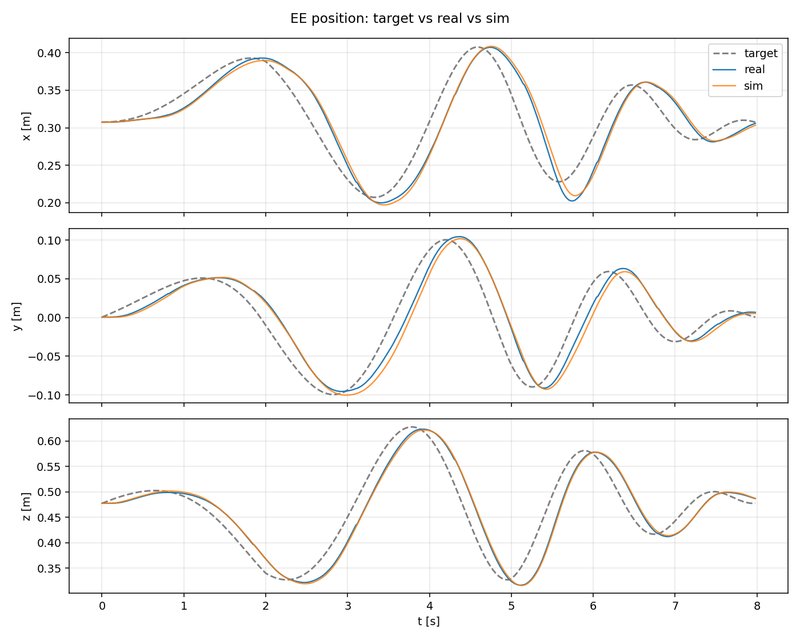
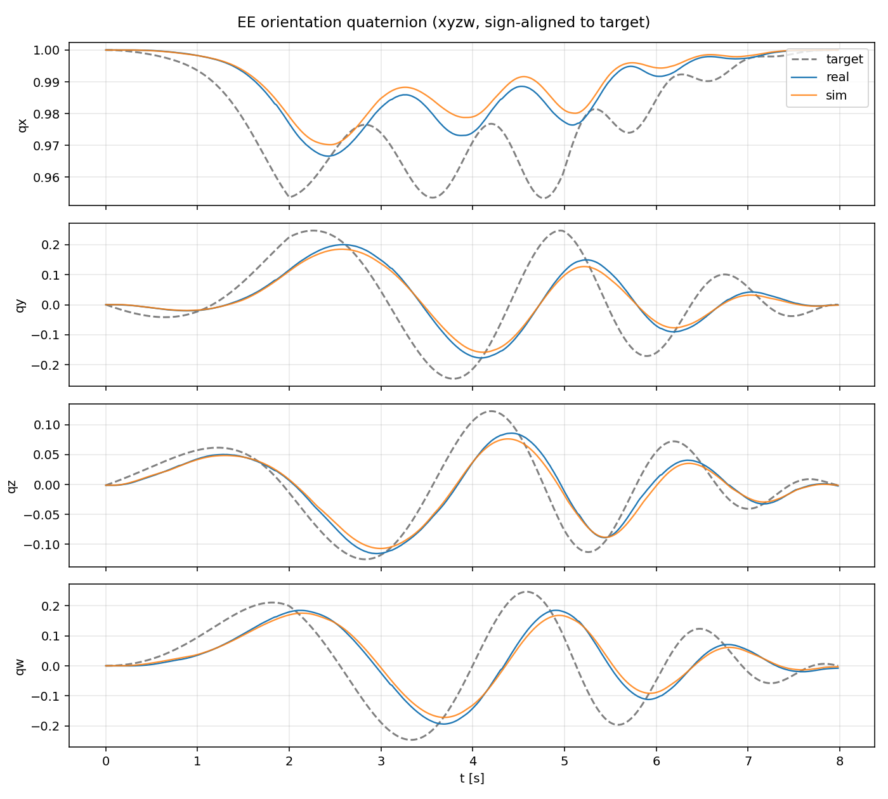
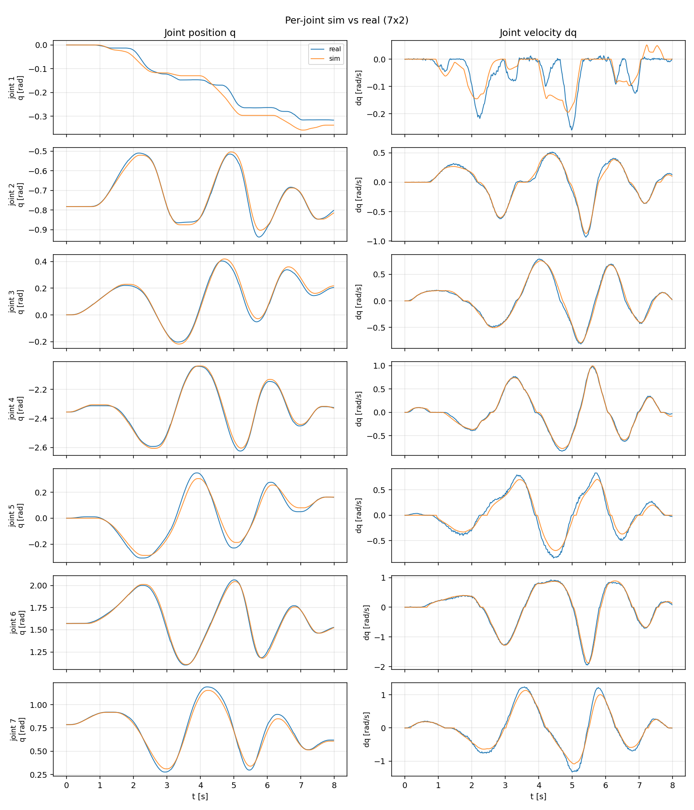

# FrankaTwin

Real-time Cartesian impedance control for the **Franka Research 3** tuned for **sim-to-real transfer**. Ships a system-ID pipeline that matches IsaacLab to the real arm.

## Highlights

- **1 kHz Cartesian impedance controller** on the NUC (libfranka).
- **PC↔NUC** split: realtime control on NUC, Python tooling on PC.
- **POSIX shm + ZMQ** for low-latency state / command flow.
- **Sysid** brings IsaacLab to **1-3 % joint motion RMSE** (MSE = 4.8 × 10-4 rad²).
- Two excitation trajectories: **v3** (multi-band sinusoid), **v4** (UR5e-style chirp, Franka-adapted).

## Architecture

```
     PC                               NUC                                FCI / FR3
  ┌────────┐                      ┌──────────────┐                       ┌────────┐
  │ user   │ ◄──── ZMQ ────────►  │  daemon +    │ ◄──── libfranka ────► │ robot  │
  │ code   │   ~20 Hz, ports      │  osc_shm /   │       1 kHz           │        │
  │        │   5555 / 5556        │  move_to     │                       │        │
  └────────┘                      └──────────────┘                       └────────┘
```

The daemon owns POSIX shm `/frankatwin_osc`, supervises the two C++ binaries
(mutex'd against each other — libfranka allows one FCI session at a time),
and exposes two control modes to the PC:

1. **Joint position control** — used for resets (`examples/reset_home.py` → `move_to`, libfranka MotionGenerator, min-jerk trajectory in joint space).

2. **Task-impedance control, no null-space term** — used for compliance / teleop / sysid (`examples/cart_impedance.py` → `osc_shm`, 1 kHz J<sup>T</sup> loop):

   ```
   τ = Jᵀ [K_p · e + K_d · ė] + C(q, q̇) · q̇
   e = x_des − x
   ė = −ẋ
   ```

## Installation

For NUC setup (real-time kernel, FCI network), follow
[deoxys system prerequisites](https://zhuyifengzju.github.io/deoxys_docs/html/installation/system_prerequisite.html).

### NUC (libfranka + Python)

```bash
git clone <repo> /path/to/frankatwin
cd /path/to/frankatwin

# Build C++ binaries (libfranka must be installed system-wide).
cmake -S . -B build && cmake --build build -j
ls build/osc_shm build/move_to build/read_current_q build/read_current_pose

# Install Python package (pyzmq, numpy, pyyaml).
pip install -e .

# Verify shm layout contract.
python -m pytest tests/test_shm_layout.py -q

# franka-interface (deoxys) must NOT be running -- only one FCI session at a time.
pgrep -a franka-interface && echo "kill franka-interface before continuing"
```

### PC (Python only)

```bash
git clone <repo> /path/to/frankatwin
cd /path/to/frankatwin
pip install -e ".[analysis]"      # analysis extra: pandas/matplotlib for scripts/compare_*.py
grep nuc_host config/robot.yaml   # default: 172.16.0.1
```

## Configuration

`config/robot.yaml` (shared by NUC and PC):

- `network.nuc_host` / `cmd_port` / `state_port` — ZMQ endpoints.
- `robot.ip` — FCI IP (NUC-only).
- `robot.init_q` — joint-space home.
- `control.kp_pos` / `kp_ori` — default impedance gains (runtime override via `set_gains`).
- `control.error_delta_pos` / `error_delta_rot` — per-tick `osc_shm` safety clamps (runtime override via `set_gains`).

Override the config path with `FRANKATWIN_CONFIG=/path/to/local.yaml`.

## Quick Start

### 1. Start the daemon # NUC

```bash
python -m frankatwin.daemon --config config/robot.yaml 
```

Binds `tcp://*:5555` (REQ/REP) and `tcp://*:5556` (state PUB @ 100 Hz), claims
shm `/frankatwin_osc`, launches `osc_shm`.

> **Carrying a payload? Set `--load-mass` / `--load-com` on the command line.**
> The default (`mass: 0` in `robot.yaml`) is the bare arm: no `setLoad` call,
> the Desk-configured load stays untouched. When the robot carries anything
> extra, pass the combined mass [kg] and flange→COM vector [m] at startup so
> gravity compensation stays correct:
>
> ```bash
> # ZED Mini camera only (calibrated 2026-05-31):
> python -m frankatwin.daemon -c config/robot.yaml \
>     --load-mass 0.15 --load-com 0 0 0.05
>
> # camera + 0.68 kg grasped object (object COM ~0.175 m along the tool axis):
> python -m frankatwin.daemon -c config/robot.yaml \
>     --load-mass 0.83 --load-com 0 0 0.152
> ```
>
> `--load-inertia` (row-major 3×3) is optional: when omitted and the mass is
> positive, the daemon fills a small positive diagonal (libfranka rejects an
> all-zero inertia; the exact value barely matters — gravity comp uses
> mass + com only). See the `load:` block in `config/robot.yaml` for details.

### 2. Reset to home (joint-space position control) # PC

```bash
python examples/reset_home.py    
```

Sequence: stop `osc_shm` → run `move_to` (min-jerk) → restart `osc_shm` anchored at the new pose.

### 3. Task impedance control (no null-space term) # PC

```bash
# Smoke test: 4 s z-axis sine around the current pose.
python examples/cart_impedance.py # PC

# v4 chirp for sysid (recommended Franka operating point).
python examples/cart_impedance.py --mode chirp \ 
    --rate 50 --kp-pos 500 --kp-ori 30 --f1 0.7 \
    --err-delta-pos 0.15 --err-delta-rot 0.80 \
    --log data/run_$(date +%Y%m%d_%H%M%S).csv
```

Law: `F = K_p(x_des - x) - K_d·v`, `τ = J^T F`, `K_d = 2√K_p` (critical damping).
No explicit null-space term — JT lets null motion settle under
gravity and joint damping.

### 4. Send a custom target from Python

```python
import numpy as np, time
from frankatwin.config import load_config
from frankatwin.remote_client import FrankaTwinClient

cfg = load_config()
with FrankaTwinClient(cfg) as robot:
    state = robot.wait_for_state(timeout_s=3.0)
    anchor_pos, anchor_quat = state.ee_pos, state.ee_quat   # quat is wxyz

    dt = 0.02
    for k in range(int(2.0 / dt)):
        offset = np.array([0.0, 0.0, 0.05 * np.sin(2 * np.pi * k * dt)])
        robot.set_ee_target(anchor_pos + offset, anchor_quat)
        time.sleep(dt)

    s = robot.get_state()
    print(f"q={s.q}, ee_pos={s.ee_pos}")
```

`FrankaTwinClient` methods: `set_ee_target`, `set_gains`, `get_state` /
`wait_for_state`, `move_to_q`, `move_to_pose`, `enable` / `disable`, `ping`.
All non-blocking — `set_ee_target` writes a seqlock-guarded frame to shm and
returns; `osc_shm` consumes it on the next 1 kHz tick.

## System Identification

CMA-ES over **29 parameters** (armature + static/dynamic/viscous friction × 7
joints + motor delay).

### Excitation Trajectories

Both drive the same `cart_impedance.py` loop; only the reference differs.


|             | **v3** (`gen_excitation_traj.py`)                        | **v4** (`gen_chirp_traj.py`)                                                                          |
| ----------- | -------------------------------------------------------- | ----------------------------------------------------------------------------------------------------- |
| Spectrum    | two-band sinusoid per axis (≈ 0.15-0.30 Hz + 0.7-1.1 Hz, high-band 0.2×) | linear chirp f0→f1, 0.1→0.7 Hz                                                                        |
| Active DOFs | x, y, z + yaw / roll (on by default)                     | x, y, z, rx, ry, rz (always-on, π/3 phase-staggered)                                                  |
| Amplitudes  | 10 / 10 / 8 cm + 0.25 / 0.20 rad yaw / roll             | 10 / 10 / 15 cm + 0.50 / 0.25 / 0.50 rad                                                              |
| Envelope    | symmetric 2 s half-cosine                                | asymmetric 2 s up / 3 s down (linear)                                                                 |
| Duration    | 12 s                                                     | 8 s                                                                                                   |
| Origin      | in-house                                                 | UR5e `[diffusion_policy/scripts/sim2real/collect_sysid_data.py](https://github.com/uw-lab/omnireset)` |


v3's defaults reproduce the 2026-05-25 collection — the highest-weighted (1.5) trajectory in the published fit. Amplitudes / ratio are baked into the script defaults; pass `--base-sidecar` to pick up that run's anchor pose. Use `--amp-yaw 0 --amp-roll 0` to recover the position-only (v1/v2) variant.

v4 follows the UR5e chirp shape with three Franka-specific deltas:

1. **f1 lowered 3.0 → 0.7 Hz** (now the Franka default; 1.5 Hz was an interim value). J5–J7 effort limit (12 N·m) saturates at UR5e's 3 Hz top frequency and trips `osc_shm`'s abort clamp; 0.7 Hz keeps peak |dx| ≈ 0.46 m/s.
2. **kp lowered 1000 → 500, kpori 50 → 30** for parity with the downstream policy controller.
3. **Safety clamps relaxed** (`error_delta_pos`: 0.05 → 0.15 m, `error_delta_rot`: 0.30 → 0.80 rad) — lower kp tolerates larger steady-state error. Set via `cart_impedance.py --err-delta-pos / --err-delta-rot`.

### IsaacLab Setup (one-time)

The optimize / validate steps run inside [IsaacLab](https://github.com/isaac-sim/IsaacLab)
(tested with **v2.3.0**; requires ≥ 2.3 for the dynamic/viscous joint-friction API),
but the sysid tasks and scripts are **not part of the official distribution** —
this repo ships them under `isaaclab_sysid/`. Deploy them into your IsaacLab
checkout once:

```bash
# frankatwin
./isaaclab_sysid/install_into_isaaclab.sh /path/to/IsaacLab

# inside the IsaacLab python env
pip install cmaes
```

This copies three things into `/path/to/IsaacLab`:

- **Gym tasks** `Isaac-FrankaTwin-Sysid-v0` / `Isaac-FrankaTwin-Replay-v0`
  (`source/isaaclab_tasks/isaaclab_tasks/direct/franka_sysid/`) — Franka-only
  zero-reward envs whose task-impedance controller mirrors `osc_shm`
  (`src/osc_shm.cpp`). Auto-registered by `isaaclab_tasks`' package
  scanner; no IsaacLab source edits needed.
- **Robot asset** `franka_mimic.usd`
  (`source/isaaclab_assets/data/Robots/Franka/`) — Franka with a
  `panda_fingertip_centered` frame. The task configs reference it relative to
  the IsaacLab root, so always launch the scripts from `/path/to/IsaacLab`.
- **Scripts** `scripts/tools/{sysid_franka_osc,apply_sysid_params,replay_python_csv_sim}.py`.

### Workflow

1. Collect real data: `examples/cart_impedance.py --mode chirp …` — produces `<run>.csv` + `<run>.json`.
2. Optimize — produces `sysid_best_params.json` under `logs/sysid_franka/<ts>/`:
  ```bash
   # IsaacLab
   cd /path/to/IsaacLab
   conda activate isaaclab # activate your issaclab env
   python scripts/tools/sysid_franka_osc.py --headless \
       --real_csv     /path/to/<run>.csv \
       --real_sidecar /path/to/<run>.json \
       --num_envs 128 --max_iter 40
   # Repeat --real_csv / --real_sidecar pairs (+ optional --traj_weights "0.5,1.0,1.5")
   # for multi-trajectory joint fitting.
  ```
3. Validate by re-running in IsaacLab and overlaying:
  ```bash
   # IsaacLab
   python scripts/tools/apply_sysid_params.py \
       --best logs/sysid_franka/<ts>/sysid_best_params.json --invoke-replay \
       --real-csv <run>.csv --real-sidecar <run>.json \
       --replay-script scripts/tools/replay_python_csv_sim.py
   # frankatwin
   python scripts/compare_sim_real.py \
       --real-csv <run>.csv --sim-csv <run>_sim_sysid.csv --save
  ```

> Use `replay_python_csv_sim.py` (ZOH @ 50 Hz) for `cart_impedance.py` logs.
> The 1 kHz replay variant in IsaacLab hardcodes `sim.dt = 1/1000` — feeding
> it a 50 Hz log silently truncates sim time to 5 %.

### Example Results

v3 best params validated on a held-out v4 chirp:
**joint-position MSE = 4.8 × 10-4 rad², 0.21× the training-set score**.
IsaacLab tracks the real arm within 1-3 % of per-joint motion range.

**v3 best parameters** (`logs/sysid_franka/20260525_145807/sysid_best_params.json`):

```json
{
  "best_score": 0.002247,
  "best_params_decoded": {
    "armature":          [0.382, 0.159, 0.157, 0.174, 0.239, 0.180, 0.060],
    "mu_static":         [0.728, 1.168, 0.591, 1.026, 1.632, 1.141, 1.065],
    "dynamic_ratio":     [0.399, 0.767, 0.573, 0.794, 0.566, 0.508, 0.467],
    "mu_dynamic":        [0.291, 0.895, 0.339, 0.815, 0.924, 0.580, 0.497],
    "mu_viscous":        [3.676, 2.289, 2.875, 2.367, 3.296, 0.788, 1.937],
    "motor_delay_steps": 1
  }
}
```

EE position — sim (orange) overlays real (blue); both lag the target (dashed) identically:



EE quaternion — same story, all components track in lockstep:



Per-joint q + dq (7 stacked rows) — sim trace sits on real; per-joint RMSE 12-30 mrad (1.9-8.3 % of motion range):




## Safety Notes

- Raise user-stop and confirm FCI mode before any run.
- `franka-interface` (deoxys) must not be running concurrently.
- `osc_shm` clamps `|e_pos|_inf` and `|e_ori|` per-tick — exceeded → `τ = 0` and the arm holds. Loosen via `--err-delta-pos` / `--err-delta-rot` for soft kp + aggressive references.
- Cartesian peak conventions: `|dx|_peak ≤ 0.30 m/s`, `|ω|_peak ≤ 0.50 rad/s`. v4 chirp exceeds both by design; libfranka's internal limits are the hard boundary.

