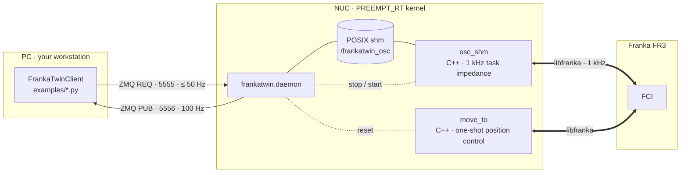

# Architecture



## Control law (`osc_shm`)

Per 1 kHz tick, with `x`, `q_cur` from `model.pose(kEndEffector)` and
`J` = `model.zeroJacobian(kEndEffector)`:

```
e_p  = x_des − x                         (clipped to ±error_delta_pos if > 0)
e_o  = 2 · vec(q_des ⊗ q_cur⁻¹)          shortest-path sign, never clipped (pure impedance)
v, ω = J q̇

F    = [ Kp_pos e_p − Kd_pos v ;  Kp_ori e_o − Kd_ori ω ]
τ    = Jᵀ F + C(q, q̇) q̇                 Coriolis from libfranka (`--no-coriolis` to drop)
τ    = clamp(τ, ±τ_max)                  τ_max = [87 87 87 87 12 12 12] N·m
τ    = slew(τ, τ_prev, 800 N·m/s)        per joint, per tick
```

- `Kd = 2√Kp` when the command's `kd_*` is 0 (the default) — critical damping.
- **No null-space term.** Jᵀ lets the redundant DOF settle under gravity and joint
  damping. This is deliberate: it is the simplest law that is trivially mirrored
  in simulation, and the sysid absorbs the resulting joint-space behaviour.
- **No apparent-mass projection** (`Λ = (J M⁻¹ Jᵀ)⁻¹`). The sim controller offers
  it as `control_mode="osc"` for experiments, but the real controller never
  uses it and neither should the sim when you compare.
- libfranka adds gravity and friction compensation on top of the commanded τ.
  `tau` in the state frame is the commanded impedance torque (gravity *excluded*);
  `tau_J` is the measured link-side torque (gravity *included*) and is what you
  compare against the actuator limits.

The IsaacLab mirror is `isaaclab_sysid/.../franka_sysid/control.py`
(`compute_task_space_torques`, `control_mode="task_impedance"`). If you touch one,
touch the other.

## Shared memory

`osc_shm` and the daemon meet in one 393 360 B POSIX segment
(`/frankatwin_osc`): a 32 B header, a 112 B command block written under a
seqlock, and a 1024-frame ring of 384 B state frames. The layout is an ABI —
`src/shm_layout.h` (with `static_assert`s on every offset) and
`python/frankatwin/shm_layout.py` (numpy dtypes) must agree, and
`tests/test_shm_layout.py` compiles the header with `g++` and diffs `offsetof`
against the dtypes to prove they do. Any field change bumps
`FRANKATWIN_SHM_VERSION` (currently 3).

| region | size | writer → reader | protocol |
|---|---|---|---|
| `ShmHeader` | 32 B | both | `magic`, `version` (3), `state_frames` (1024), `controller_pid`, `state_head` (atomic 64-bit) |
| `ShmCommand` | 112 B | client → `osc_shm` | **seqlock**: writer bumps `seq` to odd, writes, bumps to even; reader retries while `seq` is odd or changed. Fields: `target_pos[3]`, `target_quat[4]` wxyz, `kp_pos`, `kp_ori`, `kd_pos`, `kd_ori`, `error_delta_pos`, `enabled` |
| `ShmStateFrame[1024]` | 384 B each | `osc_shm` → client | **SPSC ring** indexed by `state_head`; frame `seq` validates a read. Fields: `seq`, `timestamp_s`, `q[7]`, `dq[7]`, `ee_pos[3]`, `ee_quat[4]`, `tau[7]`, `ee_linvel[3]`, `ee_angvel[3]`, `tau_J[7]` |

- **Python**: `SharedMemoryAccess(name="/frankatwin_osc", create=False).view`
  → `ShmView` with `read_command()`, `write_command(...)`, `latest_state()`,
  `last_k_states(k)`, `controller_pid`, `state_head`.
- **C / C++**: `#include "shm_layout.h"`; `panda_shm::cmd_write_begin / cmd_write_end`,
  `cmd_read`, `state_publish`, `state_read_latest`.

## Daemon behaviour

- **One lock around every command.** `ping`, `set_ee_target`, `set_gains`,
  `enable`, `disable`, `get_state`, `move_to_q`, `move_to_pose`, `log_start`,
  `log_stop`, `log_fetch` and `shutdown` are JSON over a ZMQ REQ/REP socket and
  run one at a time, so a `move_to_*` — which stops `osc_shm`, runs `move_to`
  and restarts it — can never interleave with a setpoint write. Only a
  `log_fetch` reply carries more than JSON: a second frame with the rows of a
  1 kHz log as raw float64. The daemon writes no run data to disk; the client
  does, on the PC.
- **Gains outlive the controller.** `osc_shm` seeds the command block with its
  own defaults and the *current* EE pose as target, so the arm holds in place.
  The daemon then overwrites the gain fields — on the first start with the
  `control:` block of `robot.yaml`, on every later start (inside `move_to_*`, a
  watchdog relaunch) with a snapshot of whatever the client last set via
  `set_gains` (`snapshot_gains` / `restore_gains` in `local_controller.py`).
  Gains, clamps and `enabled` therefore persist across controller restarts;
  only the anchor pose is re-captured.
- **Watchdog.** Every 0.5 s the daemon checks that `osc_shm` is alive and
  relaunches it if not, so a libfranka reflex mid-run cannot leave the daemon
  ACKing commands into a dead controller. The relaunch re-anchors the setpoint
  at the current pose and restores the gains; the client's next
  `set_ee_target` resumes control.

- **Two workers, not user interfaces.** `osc_shm` (the 1 kHz controller) and
  `move_to` (one-shot resets) are spawned by the daemon; running either by hand
  while the daemon is up is refused by the FCI lock (`src/fci_lock.h`). The
  three `read_*` binaries only `readOnce()` and `gripper_cmd` uses the hand's
  own connection (port 1338), so those take no lock and run alongside it.

### Running it

<kbd>NUC</kbd> `python -m frankatwin.daemon [-c robot.yaml] [-v] [--load-mass KG …]`
(`--help` lists the flags). `-v` passes `osc_shm`'s own output through; the
banner you should see:

```
[osc_shm] robot_ip = 172.16.0.2
[osc_shm] shm_name = /frankatwin_osc (opened)
[osc_shm] pid      = 12345
[osc_shm] RT       = SCHED_FIFO                       # "non-RT" -> no rtprio; fix before real runs
[osc_shm] tau_rate = 800.000000 Nm/s (slew limit)
[osc_shm] load     = none (using Desk-configured load) # or: 0.15 kg, com=[0, 0, 0.05] m (gravity-compensated)
[osc_shm] collision = torque 100 Nm, cartesian 100 N/Nm (reflex thresholds)
[osc_shm] q_init    = …                               # joints at start
[osc_shm] x_anchor  = …                               # EE pose the controller holds until a client sends a target
[osc_shm] quat (wxyz) = …
[osc_shm] starting 1 kHz loop. SIGINT to stop.
INFO frankatwin.local_controller: osc_shm running; gains restored: kp=200.0/20.0 err_delta_pos=0.000 enabled=True
INFO frankatwin.daemon: daemon ready, awaiting commands
```

`WARN: setLoad FAILED` means the payload is **not** compensated; `RT = non-RT`
means the loop runs without real-time priority — fix both before real runs.
A `move_to_*` stops `osc_shm`, runs `move_to` and restarts `osc_shm` at the new
pose; the first `robot.control()` after that can be rejected with `Move command
aborted!`, which the daemon retries up to 3 times, 0.5 s apart. In the log,
`watchdog: osc_shm restarted` marks a controller that died mid-run (the
preceding `osc_shm exited unexpectedly (code=…)` line carries libfranka's
reason).

`Ctrl-C` (or `{"op": "shutdown"}`) is a controlled stop: `osc_shm` ramps its
torque to zero, waits for the arm to settle and exits; the daemon unlinks the
shm segment and releases the ports. Don't `kill -9` it.

Restart the daemon after editing `robot.yaml` (it reads the file once, at
start; no rebuild needed) and after rebuilding `osc_shm`, `move_to` or
`gripper_cmd`. One daemon per robot: a second one fails to bind the ports, and
any other *controlling* FCI client (`franka-interface`, `franka_ros*`) must be
stopped first — libfranka allows one control session at a time;
`python -m frankatwin.doctor` lists competitors.

## Daemon protocol

Any language that speaks ZMQ + JSON can drive the arm. Two sockets on the NUC
(`network.cmd_port` / `network.state_port`, default 5555 / 5556):

**Commands — REQ/REP, one JSON object per request.**
Request `{"op": "<name>", ...}`; reply `{"ok": true, ...}` or
`{"ok": false, "error": "<message>"}`. Commands are executed one at a time.
Every reply is that single JSON frame, except `log_fetch`, which appends one
binary frame (read it with `recv_multipart`).

| `op` | request fields | reply fields | blocking |
|---|---|---|---|
| `ping` | — | `pid` (osc_shm pid, `0` = controller not running) | no |
| `set_ee_target` | `pos: [x, y, z]`, `quat: [w, x, y, z]` | `head` (state_head after the write) | no |
| `set_gains` | any of `kp_pos`, `kp_ori`, `kd_pos`, `kd_ori`, `error_delta_pos` | — | no |
| `enable` / `disable` | — | — | no |
| `get_state` | — | `state`: object (fields as below) or `null` | no |
| `log_start` | optional `poll_hz`. A `path` is refused: the daemon writes no files | `path` (`null`), `seq_start`, `poll_hz`, `log_id` | no — a daemon thread drains the ring |
| `log_stop` | — | ring-log summary (`path`, `targets_path` — both `null`, the log stays in memory — `num_frames`, `seq_first`, `seq_last`, `duration_s`, `num_targets`, `gaps`, `dropped_frames`, `resets`, `poll_hz`, `log_id`) | yes (merges frames and setpoints) |
| `log_fetch` | optional `table` (`"merged"` \| `"targets"`, default `"merged"`), `offset` (0), `count` (capped at 20000) | `table`, `offset`, `count`, `total`, `columns`, `dtype` (`"<f8"`), `log_id` — **plus a second ZMQ frame**: the `count × len(columns)` rows, C-order little-endian float64 | no |
| `move_to_q` | `q: [7]`, optional `q_max_speed` | — | yes |
| `move_to_pose` | `pos: [3]`, `quat: [4] wxyz`, optional `q_max_speed` | — | yes |
| `gripper_homing` | — | `started: true`, `seq` | no — runs on a daemon thread |
| `gripper_move` | `width` [m], optional `speed` | `started: true`, `seq` | no — runs on a daemon thread |
| `gripper_grasp` | optional `width`, `speed`, `force`, `epsilon_inner`, `epsilon_outer` (defaults: `robot.yaml → gripper`) | `started: true`, `seq` | no — runs on a daemon thread |
| `gripper_stop` | — | `result` | yes (quick) |
| `gripper_state` | optional `fresh: true` | `busy`, `last` (output of the last finished command: `ok`, `cmd`, `result`, `stopped`, `state`, `seq`, or `error`), `state` (live readOnce, only with `fresh` and not busy) | `fresh`: one round trip to the hand |
| `shutdown` | — | `shutting_down: true` | no (daemon exits after replying) |

Gripper commands return as soon as the daemon has started them, so a policy
loop's `set_ee_target` is never held behind a 2 s grasp on the serial REQ/REP
socket. Poll `gripper_state` (without `fresh`) until `busy` is false and
`last.seq` matches — that is what the Python client's `wait=True` does. A
second command while one is running is refused (`gripper busy`); `gripper_stop`
aborts it.

**State — PUB, JSON, 100 Hz** (sent whenever a new 1 kHz frame exists):

```json
{"timestamp_s": 12.345, "seq": 12345,
 "q": [7], "dq": [7], "ee_pos": [3], "ee_quat": [4],
 "ee_linvel": [3], "ee_angvel": [3], "tau": [7], "tau_J": [7]}
```

Minimal raw client (this is all `FrankaTwinClient` does underneath):

```python
import json, zmq
ctx = zmq.Context()
req = ctx.socket(zmq.REQ); req.connect("tcp://172.16.0.1:5555")
sub = ctx.socket(zmq.SUB); sub.connect("tcp://172.16.0.1:5556"); sub.setsockopt(zmq.SUBSCRIBE, b"")

req.send_json({"op": "set_gains", "kp_pos": 500, "kp_ori": 30}); assert req.recv_json()["ok"]
state = json.loads(sub.recv())                                   # latest frame
req.send_json({"op": "set_ee_target", "pos": state["ee_pos"], "quat": state["ee_quat"]}); req.recv_json()
```

Clients should time out on REQ (the Python client uses 5 s, 60 s for `move_to_*`)
and rebuild the socket on timeout — ZMQ REQ sockets are strictly alternating.

## Safety chain

Ordered from first to last line of defence:

1. **Reference pre-flight** (Python, before anything is sent): the trajectory
   generators and `python examples/cart_impedance.py` print peak `|ẋ|`, `|ω|` and the max
   orientation offset of the commanded trajectory. Reported for inspection
   only -- nothing caps them; `osc_shm`'s tracking-error clamp is the
   safety net.
2. **Error clamp** (`error_delta_pos`, per tick): when > 0, clips the
   position error coordinate-wise *and* aborts the loop if the unclipped
   error exceeds it — bounds the controller's own translational push to
   `Kp_pos · error_delta_pos` (≈ 25 N at `kp_pos=500`, `0.05 m`). **`robot.yaml`
   ships `0`**, which disables both: pure impedance, matching what `osc_shm`
   compiles in and what the sim does, and what the sysid excitations need — a
   0.05 clamp caps the push at 10 N at `kp_pos=200`, too little to follow
   `multiband`, so the loop aborts. Set a positive value to get the clamp and
   the abort back. The orientation channel has no clamp and no tracking abort
   at any setting. Override at runtime with `set_gains(error_delta_pos=…)` or
   `python examples/cart_impedance.py --err-delta-pos`.
3. **Torque clamp** `τ_max` per joint.
4. **Torque slew limiter** 800 N·m/s per joint (libfranka's own limit is
   1000). The Jᵀ law emits a torque *step* whenever its input jumps — a new
   setpoint, `set_gains`, `enable`/`disable`, a phase boundary in a scripted
   motion. Without the limiter a 7.5 N lateral step at an outstretched
   configuration produced Δτ₁ ≈ 2.9 N·m in one tick (≈ 2900 N·m/s) and tripped
   `controller_torque_discontinuity`. With it, transitions ramp over a few ms and
   in-phase motion is untouched.
5. **Controlled stop**: SIGINT/SIGTERM/duration/abort do not return
   `MotionFinished` with a zero-torque step; the slew limiter ramps τ to zero and
   the loop finishes once `|τ|∞ < 0.05 N·m` and `|q̇|∞ < 0.05 rad/s` (or after
   1 s).
6. **libfranka reflexes**: collision thresholds (configurable; 100 N / 100 N·m by
   default because insertion contact at `kp_pos=500` legitimately reaches ~25 N
   and the factory 20 N default aborted every insertion), joint/velocity/torque
   limits, `communication_constraints_violation`.
7. **`automaticErrorRecovery()`** at `osc_shm` start clears a latched reflex so one
   incident doesn't require a daemon restart.
8. **Watchdog** relaunch (above).

Nominal joint-limit checks in `osc_shm`/`move_to` are warnings, not aborts — the
robot's hard limits still apply at the driver level.

## IsaacLab tasks

Installed into an IsaacLab checkout by `isaaclab_sysid/install_into_isaaclab.sh`
(package `isaaclab_tasks.direct.franka_sysid`, asset `franka_mimic.usd`, the four
scripts under `scripts/tools/` — re-run it after pulling, the scripts are copies):

| task id | env class | purpose | key cfg fields |
|---|---|---|---|
| `Isaac-FrankaTwin-Replay-v0` | `FrankaTwinReplayEnv` | Replay a target trajectory under the mirrored controller; log the sim state. | `control_mode` (`task_impedance` \| `osc`), `use_nullspace`, `q_init`, `traj_log_path`, gains in `ctrl` |
| `Isaac-FrankaTwin-Sysid-v0` | `FrankaTwinSysidEnv` | Same controller, `DelayedPDActuator` on the arm, one env block per trajectory; the optimizer drives it with `set_q_init_per_env()`, `physics_step()` and `arm_state()`. | as above + per-env q_init / gains / armature / friction / delay written by the sysid script |

| script | role |
|---|---|
| `sysid_franka_osc.py --real_csv … --real_sidecar … [--num_envs 512] [--max_iter 40] [--traj_weights w1,w2,…] [--eval_params …]` | CMA-ES over 29 parameters → `logs/sysid_franka/<ts>/sysid_best_params.json`; with `--eval_params`, scores one fixed parameter set instead. `--traj_weights` gives one weight per run (default 1.0 each) |
| `apply_sysid_params.py --best … [--invoke-replay --real-csv … --real-sidecar … [--no-compare] [--compare-dir D] [--show]] [--print-snippet]` | Replay with the fitted parameters, then compare sim against real (figures + `metrics.json`); or print actuator-config overrides |
| `replay_python_csv_sim.py --real-csv … --real-sidecar … [--sysid-params …] [--gain-source sidecar\|env_cfg]` | ZOH replay of a 50 Hz log at 1 kHz |

Details and the parameterisation: [System identification](sysid.md).

## Repository layout

```
src/                 C++: osc_shm (1 kHz controller), move_to (reset), gripper_cmd, read_* utilities,
                     shm_layout.h (the shm ABI), fci_lock.h
python/frankatwin/   daemon, FrankaTwinClient (PC), LocalController (NUC), config, shm_layout,
                     ring_log, quat, doctor, excitation/ (multiband + chirp reference math)
config/robot.yaml    network, robot IP, gains, safety clamps, collision thresholds, gripper, payload
examples/            move_to (home / joints / EE pose), cart_impedance (sine / multiband / chirp),
                     gripper, policy_loop
scripts/             gen_*_traj (write references), shm_log, check_torque_limits, plot_ee_tracking,
                     read_q.sh
isaaclab_sysid/      self-contained IsaacLab extension: the two tasks, franka_mimic.usd, and the four
                     scripts/tools/ (sysid fit, ZOH replay, apply + compare)
tests/               11 pytest files, none of which need a robot: the shm ABI (compiles shm_layout.h
                     and diffs every offset against the numpy dtypes), config, doctor, excitation
                     math, quaternions, ring log, gain persistence, gripper, command round-trip,
                     1 kHz logging, sim-vs-real comparison
docs/                Guide: installation · usage · sysid.  Reference: sysid_details · architecture ·
                     configuration · api · data_format · troubleshooting
```
