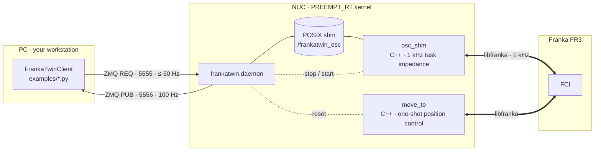

# Architecture



## Processes

| process | file | role |
|---|---|---|
| `osc_shm` | `src/osc_shm.cpp` | Long-running 1 kHz torque controller. Reads setpoint + gains from shm every tick, publishes the robot state into shm every tick. Owns the libfranka session while it runs. |
| `move_to` | `src/move_to.cpp` | One-shot joint-space (`--q`, libfranka `MotionGenerator`, min-jerk) or Cartesian (`--pose`, `franka::CartesianPose`, 5th-order profile) motion. Used for resets. |
| `frankatwin.daemon` | `python/frankatwin/daemon.py` | Creates the shm segment, supervises `osc_shm`, serialises `move_to` against it, bridges ZMQ ↔ shm. |
| `LocalController` | `python/frankatwin/local_controller.py` | The daemon's in-process controller handle (also usable directly on the NUC without ZMQ). |
| `FrankaTwinClient` | `python/frankatwin/remote_client.py` | PC-side client; same method signatures as `LocalController`. |
| `read_current_q` / `read_current_pose` / `read_load` | `src/read_*.cpp` | One-shot `readOnce()` utilities (need the FCI session, so stop the daemon first). |

## Control law (`osc_shm`)

Per 1 kHz tick, with `x`, `q_cur` from `model.pose(kEndEffector)` and
`J` = `model.zeroJacobian(kEndEffector)`:

```
e_p  = x_des − x                         (clipped to ±error_delta_pos if > 0)
e_o  = 2 · vec(q_des ⊗ q_cur⁻¹)          shortest-path sign, clipped to ±error_delta_rot if > 0
v, ω = J q̇

F    = [ Kp_pos e_p − Kd_pos v ;  Kp_ori e_o − Kd_ori ω ]
τ    = Jᵀ F + C(q, q̇) q̇                 Coriolis from libfranka (`--no-coriolis` to drop)
τ    = clamp(τ, ±τ_max)                  τ_max = [87 87 87 87 12 12 12] N·m
τ    = slew(τ, τ_prev, 800 N·m/s)        per joint, per tick
```

- `Kd = 2√Kp` when the command's `kd_*` is 0 (the default) — critical damping.
- **No null-space term.** Jᵀ lets the redundant DOF settle under gravity and joint
  damping. This is deliberate: it is the simplest law that is trivially mirrored
  in simulation, and the sysid absorbs the resulting joint-space behaviour.
- **No apparent-mass projection** (`Λ = (J M⁻¹ Jᵀ)⁻¹`). The sim controller offers
  it as `control_mode="osc"` for experiments, but the real controller never
  uses it and neither should the sim when you compare.
- libfranka adds gravity and friction compensation on top of the commanded τ.
  `tau` in the state frame is the commanded impedance torque (gravity *excluded*);
  `tau_J` is the measured link-side torque (gravity *included*) and is what you
  compare against the actuator limits.

The IsaacLab mirror is `isaaclab_sysid/.../franka_sysid/control.py`
(`compute_task_space_torques`, `control_mode="task_impedance"`). If you touch one,
touch the other.

## Shared memory

`src/shm_layout.h` and `python/frankatwin/shm_layout.py` describe one 384 KiB
segment (`/frankatwin_osc`) with a fixed ABI, version-stamped in the header and
pinned by `tests/test_shm_layout.py` (compiles the header with `g++`, dumps
`offsetof` for every field, diffs against the numpy dtype):

```
ShmHeader     32 B   magic 'PAND', version 3, state_frames 1024, controller_pid, state_head
ShmCommand   120 B   seq, target_pos[3], target_quat[4] (wxyz), kp_pos, kp_ori, kd_pos, kd_ori,
                     error_delta_pos, error_delta_rot, enabled
ShmStateFrame 384 B  seq, timestamp_s, q[7], dq[7], ee_pos[3], ee_quat[4] (wxyz), tau[7],
                     ee_linvel[3], ee_angvel[3], tau_J[7]           × 1024 ring buffer
```

- **Command (Python → C++)** is a seqlock: the writer bumps `seq` to odd, writes,
  bumps to even; the 1 kHz reader retries if `seq` changed or was odd. Writes are
  whole-frame, so `set_gains` and `set_ee_target` each re-publish the fields they
  don't change.
- **State (C++ → Python)** is a single-producer ring indexed by `state_head`
  (monotonic). `latest_state()` reads the newest slot and validates `seq`; the
  daemon publishes it over ZMQ at 100 Hz, the client caches the last 256 frames.
- `controller_pid` is stamped by `osc_shm` and zeroed by the daemon when it stops
  the controller; `ping` returns it so a client can tell whether the controller
  is alive.

## Daemon behaviour

- **Startup**: create + zero shm → spawn `osc_shm` → wait until `state_head`
  advances → write gains/clamps into the command block. `osc_shm` seeds the
  command with the *current* EE pose as target (so the arm holds in place) and
  its built-in defaults (`kp 200/20`, clamps off); the daemon then overwrites
  the gain fields — on the first start with the `control:` block of
  `robot.yaml`, on every later start (inside `move_to_*`, watchdog relaunch)
  with a snapshot of whatever the client last set via `set_gains`. Gains,
  clamps and `enabled` therefore persist across controller restarts; only the
  anchor pose is re-captured (`snapshot_gains` / `restore_gains` in
  `local_controller.py`).
- **Commands** (`ping`, `set_ee_target`, `set_gains`, `enable`, `disable`,
  `get_state`, `move_to_q`, `move_to_pose`, `shutdown`) are JSON over a ZMQ
  REQ/REP socket and run under one lock, so a `move_to_*` (which stops
  `osc_shm`, runs `move_to`, restarts `osc_shm`) can never interleave with a
  setpoint write.
- **Restart after `move_to`**: the first `robot.control()` of a freshly started
  `osc_shm` can be rejected with `Move command aborted!` while the previous
  session winds down; the daemon retries the launch up to 3 times (0.5 s apart).
- **Watchdog**: every 0.5 s the daemon checks that `osc_shm` is alive and
  relaunches it if not (logging the exit code and captured stderr), so a
  libfranka reflex mid-run cannot leave the daemon ACKing commands into a dead
  controller. The relaunch re-anchors the setpoint at the current pose and
  restores the client's gains/clamps (see *Startup*); the client's next
  `set_ee_target` resumes control. The daemon logs `watchdog: osc_shm restarted`.
- **Payload**: `--load-mass/--load-com/--load-inertia` (or `load:` in the yaml)
  are forwarded to `osc_shm`, which calls `robot.setLoad()` before entering
  control. A rejected load is a warning, not a crash.
- **Collision thresholds**: `collision:` in the yaml → `setCollisionBehavior`.

## Safety chain

Ordered from first to last line of defence:

1. **Reference pre-flight** (Python, before anything is sent): the trajectory
   generators and `python examples/cart_impedance.py` print peak `|ẋ|`, `|ω|` and the max
   orientation offset and warn against the 0.30 m/s / 0.50 rad/s conventions.
2. **Error clamp** (`error_delta_pos/rot`, per tick): when > 0, clips the
   position/orientation error coordinate-wise *and* aborts the loop if the
   unclipped error exceeds it — bounds the controller's own push to
   `Kp · error_delta` (≈ 25 N at `kp_pos=500`, `0.05 m`). `robot.yaml` sets
   0.05 m / 0.30 rad as the daemon's initial values; `0` disables both (pure
   impedance, what the sim does). Override at runtime with
   `set_gains(error_delta_pos=…, error_delta_rot=…)` or
   `python examples/cart_impedance.py --err-delta-pos/--err-delta-rot`.
3. **Torque clamp** `τ_max` per joint.
4. **Torque slew limiter** 800 N·m/s per joint (libfranka's own limit is
   1000). The Jᵀ law emits a torque *step* whenever its input jumps — a new
   setpoint, `set_gains`, `enable`/`disable`, a phase boundary in a scripted
   motion. Without the limiter a 7.5 N lateral step at an outstretched
   configuration produced Δτ₁ ≈ 2.9 N·m in one tick (≈ 2900 N·m/s) and tripped
   `controller_torque_discontinuity`. With it, transitions ramp over a few ms and
   in-phase motion is untouched.
5. **Controlled stop**: SIGINT/SIGTERM/duration/abort do not return
   `MotionFinished` with a zero-torque step; the slew limiter ramps τ to zero and
   the loop finishes once `|τ|∞ < 0.05 N·m` and `|q̇|∞ < 0.05 rad/s` (or after
   1 s).
6. **libfranka reflexes**: collision thresholds (configurable; 100 N / 100 N·m by
   default because insertion contact at `kp_pos=500` legitimately reaches ~25 N
   and the factory 20 N default aborted every insertion), joint/velocity/torque
   limits, `communication_constraints_violation`.
7. **`automaticErrorRecovery()`** at `osc_shm` start clears a latched reflex so one
   incident doesn't require a daemon restart.
8. **Watchdog** relaunch (above).

Nominal joint-limit checks in `osc_shm`/`move_to` are warnings, not aborts — the
robot's hard limits still apply at the driver level.

## Timing

| path | rate |
|---|---|
| `osc_shm` control loop | 1 kHz, `SCHED_FIFO` 80 |
| state → shm | every tick |
| shm → ZMQ PUB | 100 Hz (latest frame, dropped if the subscriber is slow) |
| client `set_ee_target` | as fast as you call it; 20–50 Hz typical. The target is zero-order-held between writes, and the sim replay reproduces exactly that staircase. |
| `get_state()` | cached, non-blocking; `fresh=True` forces a REQ round-trip |
