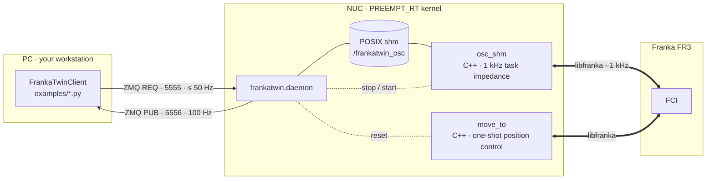

# FrankaTwin

```{image} images/logo.png
:width: 420px
:align: center
:alt: FrankaTwin — sim ↔ real
```

A 1 kHz task impedance controller for the **Franka Research 3 / Panda** whose
simulation twin is *the same controller* — plus the system identification that
makes the twin's dynamics match the real arm to within 1–3 % of joint motion
range.

- **Task impedance control, identical in sim and on the robot.** The controller
  is the task-space impedance law that sim-to-real work such as
  [IndustReal](https://arxiv.org/abs/2305.17110) and
  [OmniReset](https://weirdlabuw.github.io/omnireset/) trains policies on.
  `osc_shm` (libfranka, 1 kHz) and the IsaacLab controller are the same law
  with the same gains, damping rule and torque slew limit.
- **System identification that closes the loop.** A CMA-ES fit of 29
  parameters (armature, static / dynamic / viscous friction, motor delay) drives
  the sim replay of real excitation runs — joint-position MSE 4.8 × 10⁻⁴ rad²
  on a held-out chirp.
- **Small and auditable.** ~700 lines of C++, ~900 lines of Python, POSIX
  shared memory + ZMQ in between. No ROS.



Start with the [Quick start](quickstart.md) — every command tagged
<kbd>NUC</kbd> / <kbd>PC</kbd> / <kbd>SIM</kbd> — then [Usage](usage.md) for
the scripts and the client API. The full guide and the reference (API from
docstrings, contributing, changelog) are in the sidebar.

```{toctree}
:hidden:
:caption: Guide

quickstart
installation
usage
architecture
sysid
data_format
troubleshooting
```

```{toctree}
:hidden:
:caption: Reference

api
contributing
changelog
```
