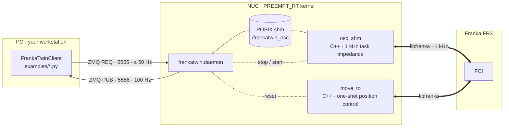

# FrankaTwin

**Current version: v0.3** — package `frankatwin` 0.3.0, git branch `v0.3`. This
documentation describes v0.3; what changed is in the [changelog](changelog.md).

```{image} images/logo.png
:width: 420px
:align: center
:alt: FrankaTwin — sim ↔ real
```

A 1 kHz task impedance controller for the **Franka Research 3 / Panda** whose
simulation twin is *the same controller* — plus the system identification that
that cuts the twin's joint-position error on a held-out run to a fifth of what
the PhysX defaults give (54 mrad RMSE over all seven joints).

- **Task impedance control, identical in sim and on the robot.** `osc_shm`
  (libfranka, 1 kHz) and the IsaacLab controller are the same task-space
  impedance law with the same gains and damping rule — the
  control scheme used by sim-to-real work such as
  [IndustReal](https://arxiv.org/abs/2305.17110) and
  [OmniReset](https://weirdlabuw.github.io/omnireset/).
- **System identification that closes the loop.** A CMA-ES fit of 29
  parameters (armature, static / dynamic / viscous friction, motor delay) drives
  the sim replay of real excitation runs — joint-position MSE 3.0 × 10⁻³ rad²
  on a held-out multiband run, a waveform and a gain set the fit never saw.
- **Small and auditable.** ~1 600 lines of C++ and ~3 300 lines of Python
  (excluding blanks and comments), POSIX shared memory + ZMQ in between. No ROS.



Start with [Installation](installation.md), then [Usage](usage.md) — every
command is tagged <kbd>NUC</kbd> / <kbd>PC</kbd> / <kbd>SIM</kbd> with the
machine it runs on. The reference (architecture and wire protocols,
configuration, API from docstrings, data formats, troubleshooting) is in the
sidebar.

```{toctree}
:hidden:
:caption: Guide

installation
usage
sysid
```

```{toctree}
:hidden:
:caption: Reference

sysid_details
architecture
configuration
api
data_format
troubleshooting
contributing
changelog
```
