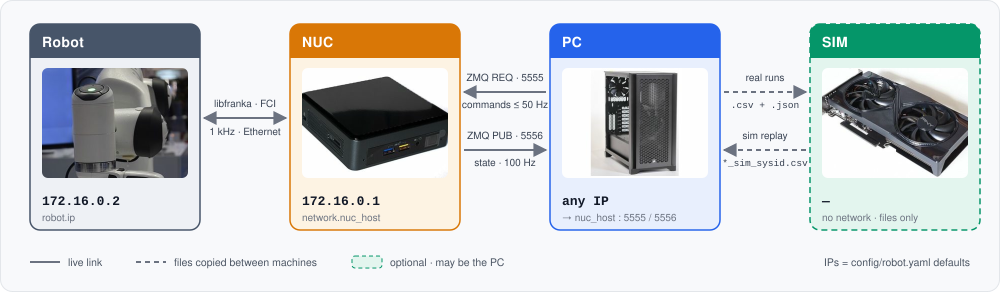

# Installation

Three machines can be involved; one section per machine below. Elsewhere in these
docs every command carries the tag of the machine it runs on:

| tag | machine | runs | software (tested) |
|---|---|---|---|
| — | **Robot** | — | Franka Research 3 or Panda, Franka Hand attached, FCI enabled in Desk; libfranka is chosen from the robot system version (see NUC) |
| <kbd>NUC</kbd> | real-time PC wired to the robot (FCI) | `python -m frankatwin.daemon` → `osc_shm` / `move_to` | Ubuntu 20.04 / 22.04 with `PREEMPT_RT` kernel · conda env `frankatwin` (all conda-forge): libfranka matched to the robot system (0.20 for system 5.9), Eigen3, CMake, C++ compiler, Python 3.11 |
| <kbd>PC</kbd> | your workstation | `examples/*.py`, analysis scripts | conda env `frankatwin`: Python 3.11 (numpy, pyyaml, pyzmq; pandas + matplotlib for the analysis scripts) |
| <kbd>SIM</kbd> | any GPU box with IsaacLab (can be the PC) | sysid fit, sim replay | IsaacLab 2.3.0 (≥ 2.3 for the dynamic/viscous joint-friction API) · `cmaes` |



:::{admonition} [TODO, checklist]
:class: warning

NUC and PC read the same `config/robot.yaml` from their checkout (`pip install -e .`
is the intended install mode): `robot.ip` for the robot, `network.nuc_host` for
the NUC, plus gains, safety clamps and payload. Override with `--config` on any
command or `FRANKATWIN_CONFIG=/path/to/local.yaml`; keys are documented inline in
the file and in [Configuration](configuration.md).
:::

## Robot

Nothing to install. The FCI feature has to be present on the controller and the
robot switched into FCI mode from Desk — the web UI you open from the PC (or the
NUC) at the robot's address, `172.16.0.2` by default. Franka's guide covers it:

- [Installing the FCI Feature](https://frankarobotics.github.io/docs/doc/libfranka/docs/getting_started.html#installing-the-fci-feature)
  — one-time, needs the feature file from Franka.
- [Preparing the Robot for FCI in Desk](https://frankarobotics.github.io/docs/doc/libfranka/docs/getting_started.html#preparing-the-robot-for-fci-in-desk)
  and [Activating FCI Mode](https://frankarobotics.github.io/docs/doc/libfranka/docs/getting_started.html#activating-fci-mode)
  — every session: unlock the joints, then enable FCI (FR3 and FER differ slightly;
  both are on that page).

## NUC

### Ubuntu kernel

You need what every libfranka user needs: Ubuntu 22.04 (20.04 also works) with a
`PREEMPT_RT` kernel, a user in the `realtime` group, and the robot
reachable on `172.16.0.2` (default). Franka's own guide is the reference:
<https://frankarobotics.github.io/docs/doc/libfranka/docs/real_time_kernel.html>. The
[deoxys prerequisites page](https://zhuyifengzju.github.io/deoxys_docs/html/installation/system_prerequisite.html)
is a good condensed walkthrough of similar steps.

Check before continuing:

```bash
uname -v | grep -i preempt          # RT kernel
ulimit -r                            # >= 99 (rtprio)
ping -c1 172.16.0.2                  # FCI reachable
```

### conda environment (libfranka)

libfranka and the robot negotiate an FCI protocol version with no backward
compatibility — a wrong version builds and installs fine and fails only when
`osc_shm` opens a session (`Incompatible library version (server version: 10,
library version: 7)`). Read the robot's system version first and pick libfranka
from it:

```bash
curl -sk https://172.16.0.2/admin/api/system-version    # e.g. "5.9.2"
```

| robot system | FCI protocol | libfranka | conda-forge package |
|---|---|---|---|
| ≥ 5.9.0 | 10 | 0.18 – 0.21 | `libfranka=0.20` |
| 5.7.2 – 5.8.x | 9 | 0.15 – 0.17 | `libfranka=0.15` |
| 5.7.0 – 5.7.1 | 8 | 0.14.x | — (build from source) |
| 5.5 – 5.6 | 7 | 0.13.x | — (build from source) |

Everything on the NUC — libfranka, the C++ build and the Python package — lives in
one conda env called `frankatwin`; activate it in every terminal that builds or
runs FrankaTwin. Our FR3 is on system 5.9.2:

```bash
conda create -n frankatwin -c conda-forge python=3.11 "libfranka=0.20" \
    eigen cmake cxx-compiler pkg-config make "sysroot_linux-64=2.28"
conda activate frankatwin
conda list | grep -E "^(libfranka|libpinocchio) "    # check: libfranka 0.20.x + libpinocchio (needed by libfranka >= 0.14)
```

### Build and install

```bash
conda activate frankatwin
git clone git@github.com:tsrobcvai/frankatwin.git && cd frankatwin
cmake -S . -B build -DCMAKE_PREFIX_PATH=$CONDA_PREFIX && cmake --build build -j$(nproc)
ls build/osc_shm build/move_to build/gripper_cmd build/read_current_q build/read_current_pose build/read_load

pip install -e ".[test]"                           # numpy, pyyaml, pyzmq (+ pytest)
python -m pytest tests -q                          # shm ABI, config, excitation, cli, gripper
```

### Verify

1. **Robot**: switch FCI mode on in Desk ([Robot](#robot) above).
2. **NUC**, in the env, before any daemon is running:

```bash
./build/read_current_q 172.16.0.2    # opens one libfranka session and prints q -- read-only, the arm does not move
```

3. **NUC**, in a **second terminal**, in the env — start the daemon and leave it
   running:

```bash
python -m frankatwin.daemon          # launches osc_shm; the arm holds its pose under impedance control
```

4. **NUC**, back in the first terminal:

```bash
python -m frankatwin.doctor          # RT kernel, rtprio, binaries + ldd, FCI reachable, daemon ping + state stream
```

`read_current_q` must print seven joint angles and `doctor` must end with
`all good.`: together they show libfranka is installed, linked and speaks the
robot's protocol, and that the daemon answers on 5555 / 5556. The order matters:
`read_current_q` needs the FCI session, which the daemon holds from the moment
it starts. A `[!!] fci clients` line naming your own `osc_shm` is expected while
the daemon runs. Anything else — `[XX]` lines
([Troubleshooting → Build](troubleshooting.md#build)) or
`Incompatible library version`
([its entry](troubleshooting.md#incompatible-library-version-server-version-n-library-version-m))
— is covered there.

## PC

Same idea, Python only — a conda env called `frankatwin`, and every example or
script runs inside it:

```bash
conda create -n frankatwin -c conda-forge python=3.11
conda activate frankatwin
git clone git@github.com:tsrobcvai/frankatwin.git && cd frankatwin
pip install -e ".[analysis]"      # + pandas/matplotlib for scripts/compare_*.py, plot_*.py
```

Edit `config/robot.yaml → network.nuc_host` to the NUC's address on the PC-facing
interface (the default `172.16.0.1` assumes the PC sits on the FCI subnet; use
the NUC's LAN IP otherwise). Ports 5555 (REQ/REP) and 5556 (PUB) must be open.

### Verify

1. **NUC**, in its env: `python -m frankatwin.daemon` — still running from the
   [NUC](#nuc) verify step above, or started again now (robot in FCI mode).
2. **PC**, in its env:

```bash
python -m frankatwin.doctor          # daemon ping on 5555, state stream on 5556
```

`doctor` must end with `all good.` — the PC sees the daemon and receives the
100 Hz state stream. If it fails, `network.nuc_host` in `config/robot.yaml` is
the usual culprit ([Troubleshooting → Communication](troubleshooting.md#communication)).

## SIM

Only for the sysid loop (fit, replay, validate); skip it if you just want to
control the arm. Needs [IsaacLab](https://github.com/isaac-sim/IsaacLab) ≥ 2.3.0
(the dynamic/viscous joint-friction API landed in 2.3). Install it following
NVIDIA's guide —
[Isaac Lab local installation (v2.3.0)](https://isaac-sim.github.io/IsaacLab/v2.3.0/source/setup/installation/index.html)
— then deploy the shipped FrankaTwin extension once into that checkout, from
this repository's root (clone it on the SIM box if that is not the PC); no
IsaacLab source edits:

```bash
./isaaclab_sysid/install_into_isaaclab.sh /path/to/IsaacLab
conda activate <isaaclab env> && pip install cmaes
```

Installs `Isaac-FrankaTwin-Sysid-v0` / `Isaac-FrankaTwin-Replay-v0`
(`source/isaaclab_tasks/isaaclab_tasks/direct/franka_sysid/`, auto-registered),
`franka_mimic.usd` (Franka with a `panda_fingertip_centered` frame) and the three
scripts under `scripts/tools/`. Always launch the scripts from the IsaacLab root —
the task configs reference the USD relative to it.

---

Next: [Usage](usage.md) — start the daemon on the NUC and drive the arm from the PC.
