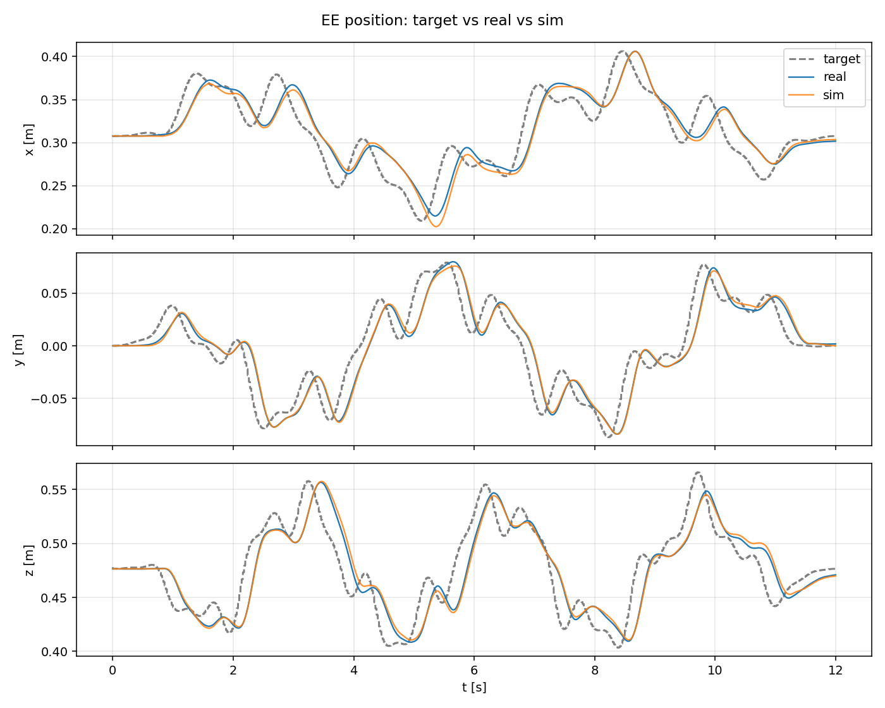
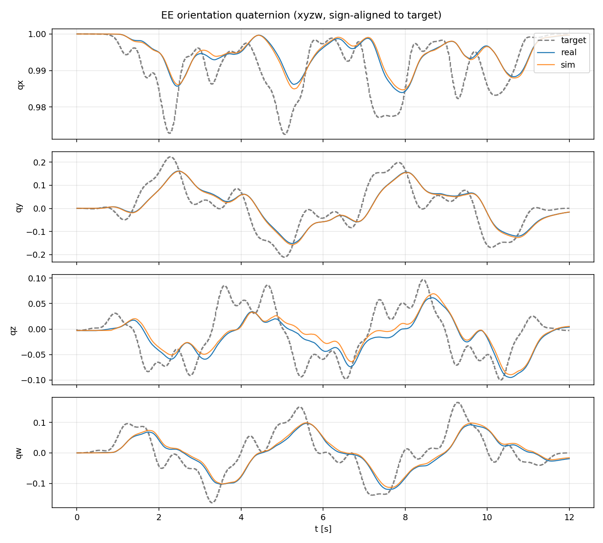
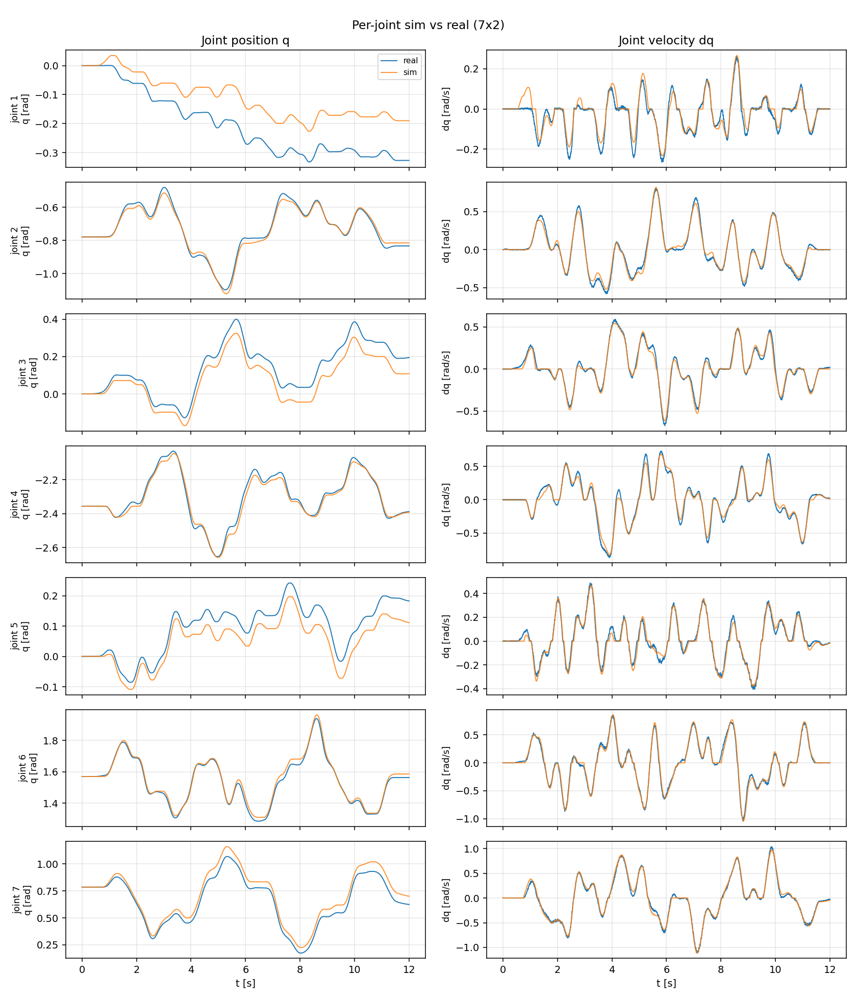

# System identification

FrankaTwin makes IsaacLab's Franka move like *your* real Franka robot under the
*same* impedance control. It replays real excitation runs in sim with identical
setpoints, gains and control law, and fits the sim's joint dynamics until the
trajectories match.

This page is the procedure to run it. For what the fit identifies, how the
optimizer works and how the excitations are designed, see
[SysID details](sysid_details.md).

## Workflow

### 1. Collect

<kbd>PC</kbd> with the daemon running on the NUC.

Collect two runs, and optionally a third. The fit sees only the first; the
second is another waveform at stiffer gains, so it tests whether the identified
dynamics still hold on a motion the fit never saw when the controller pushes
harder, and the optional third continues the same chirp above 0.7 Hz at the fit
gains.

```bash
conda activate frankatwin
cd frankatwin

# For the fit. Home the arm before every run: a run leaves the joints away from where it started
python examples/move_to.py
python examples/cart_impedance.py --mode chirp --band low --rate 50 --kp-pos 200 --kp-ori 20 \
    --log-1khz data/sysid/chirp_low_fit.csv

# Held out: another waveform, stiffer gains, never passed to step 2
python examples/move_to.py
python examples/cart_impedance.py --mode multiband --profile heldout --rate 50 --kp-pos 500 --kp-ori 30 \
    --log-1khz data/sysid/multiband_heldout.csv

# Optional, also held out: the same chirp continued to 3 Hz; loads the wrist harder -- watch the torque line
python examples/move_to.py
python examples/cart_impedance.py --mode chirp --band high --rate 50 --kp-pos 200 --kp-ori 20 \
    --log-1khz data/sysid/chirp_high_heldout.csv
```

Each run writes the CSV plus a JSON sidecar of the same name on the PC
([format](data_format.md#ring-log)); both are needed downstream, the
`<name>_targets.csv` next to them is not. Steps 2-3 run on the SIM machine, so
copy `data/sysid/` over to it first.

### 2. Fit

<kbd>SIM</kbd>

```bash
conda activate <isaaclab env>
cd /path/to/IsaacLab
DATA=~/frankatwin/data/sysid    # where step 1 wrote the runs, or where you copied them to; step 3 reuses it
python scripts/tools/sysid_franka_osc.py --headless --num_envs 512 --max_iter 40 --sigma 0.3 \
    --real_csv $DATA/chirp_low_fit.csv --real_sidecar $DATA/chirp_low_fit.json
```

The optimization takes about 1 h at 512 envs (tested on an RTX 5090) and
writes `logs/sysid_franka/<timestamp>/sysid_best_params.json` under the
IsaacLab directory.

:::{admonition} Fitting on more runs
:class: tip

If the identified dynamics should hold up better on high-acceleration motion,
add a high-frequency run such as the high band to the fit — repeat
`--real_csv` / `--real_sidecar` — and tune the weights with
`--traj_weights 1.0,1.0` (one per run; default 1.0 each). Whatever you fit on,
keep the held-out runs out of this list.
[Which trajectories to fit on](#which-trajectories-to-fit-on) has the measured
trade-off on our arm.
:::

### 3. Validate

<kbd>SIM</kbd>

Replay the validation run from step 1 — the multiband the fit never saw — with
the fitted parameters, and score it against the real run. One command does both:

```bash
python scripts/tools/apply_sysid_params.py \
    --best logs/sysid_franka/<ts>/sysid_best_params.json --invoke-replay \
    --real-csv $DATA/multiband_heldout.csv \
    --real-sidecar $DATA/multiband_heldout.json --headless
```

It leaves, next to the real CSV:

| | |
|---|---|
| `multiband_heldout_sim_sysid.csv` + `.json` | the sim trajectory and its sidecar |
| `compare_multiband_heldout_sim_sysid/*.png` | position / orientation / per-joint overlays of target, real and sim, the per-joint error and the 3-D path |
| `compare_multiband_heldout_sim_sysid/metrics.json` | the scores, sim against real: `ee.pos.rmse_m` (per axis and `3d`), `ee.ori.rmse_rad`, `joints.pos_rmse_rad` (per joint), `joints.pos_rmse_all_rad`, `joints.pos_mse_all_rad2`, `joints.vel_rmse_rad_s`; under `tracking`, each side against the target |

The replay follows the targets logged in the CSV under the gains of the
sidecar, so the optional high band, if collected, is scored by the same command
with `chirp_high_heldout.csv` / `.json`.

`--print-snippet` (instead of `--invoke-replay`) prints the fitted parameters
as a Python dict to paste into your own task's config.

## Our results

Our FR3 with a Franka Hand, fitted on the low band alone with the step 2
command above and validated on `multiband_heldout` — 12 s, three tones per
axis, kp 500/30: a waveform and a gain set the optimizer never saw. Sim
against real:

| | baseline (PhysX defaults) | fitted |
|---|---:|---:|
| EE position RMSE (3-D) | 20.02 mm | **5.27 mm** |
| EE orientation RMSE | 52.34 mrad | **17.87 mrad** |
| joint position RMSE (all joints) | 288.42 mrad | **54.34 mrad** |
| joint velocity RMSE (all joints) | 238.76 mrad/s | **36.60 mrad/s** |
| joint position MSE | 8.32 × 10⁻² rad² | **2.95 × 10⁻³ rad²** |

Blue is the real arm, orange the twin, dashed the commanded reference. The
impedance controller lags the reference by the same amount on both sides,
which is the point — a twin that tracks the reference *better* than the real
arm is a twin missing friction and delay.







Per-joint position RMSE on the held-out run [mrad]:

| | j1 | j2 | j3 | j4 | j5 | j6 | j7 |
|---|---:|---:|---:|---:|---:|---:|---:|
| baseline | 545 | 97 | 351 | 81 | 235 | 62 | 294 |
| **fitted** | **101** | **18** | **62** | **20** | **46** | **17** | **60** |

A second held-out run — the low-band chirp itself, recorded at `kp 500 / 30`:
the fit's own waveform at gains it never saw — scores with the same parameters:

| | baseline (PhysX defaults) | fitted |
|---|---:|---:|
| EE position RMSE (3-D) | 19.52 mm | **3.59 mm** |
| EE orientation RMSE | 47.20 mrad | **14.64 mrad** |
| joint position RMSE (all joints) | 470.76 mrad | **28.47 mrad** |
| joint velocity RMSE (all joints) | 320.28 mrad/s | **35.89 mrad/s** |

These are the figures the README quotes, and the run the comparison video
shows — the twin (left) beside the real arm (right), with and without the
identified parameters:

<video controls width="100%" src="https://github.com/tsrobcvai/frankatwin/releases/download/v0.3.0/frankatwin_sysid_comparison_v0.3.0.mp4">
  <a href="https://github.com/tsrobcvai/frankatwin/releases/download/v0.3.0/frankatwin_sysid_comparison_v0.3.0.mp4">frankatwin_sysid_comparison_v0.3.0.mp4</a> (1080p, 12 MB)
</video>

### Which trajectories to fit on

Two fits, same population and budget, scored on the same held-out run:

| fit | high band | held-out q | held-out EE |
|---|---:|---:|---:|
| low band only | 62.4 | 54.3 | **5.27** |
| low + high, equal weights | **27.8** | **34.1** | 5.75 |

Joint position RMSE [mrad] on the high-band run and on the held-out run, EE
position RMSE [mm] on the held-out run.

The low band alone leaves the twin weak where the low band carries no
information: more than twice the joint error on the high-band run. Adding the
high band with equal weights halves that and cuts held-out joint error by a
third, for half a millimetre of EE position — the better default if the twin
will see high-acceleration motion.

Fitted parameters (`motor_delay_steps = 3`, i.e. three 1 ms ticks):

| joint | armature [kg·m²] | μ_static [N·m] | μ_dynamic [N·m] | μ_viscous [N·m·s/rad] |
|---|---:|---:|---:|---:|
| j1 | 0.425 | 1.13 | 0.59 | 2.73 |
| j2 | 0.281 | 1.04 | 0.65 | 3.27 |
| j3 | 0.185 | 1.58 | 1.00 | 0.76 |
| j4 | 0.189 | 1.74 | 1.20 | 2.23 |
| j5 | 0.182 | 1.17 | 0.75 | 1.09 |
| j6 | 0.159 | 1.38 | 0.41 | 0.05 |
| j7 | 0.106 | 1.02 | 0.44 | 0.50 |

These are for *our* FR3; friction varies unit to unit, so run the fit on
yours and use ours only as a check on the magnitudes. The individual values
are loosely identified: across this run's checkpoints the score fell
monotonically while μ_static on j5 ranged over 0.01–1.73 N·m. The ensemble
predicts well; the numbers are not measured physical constants. No parameter
sat against an upper bound (85 % of range at most), so widening
`--armature_max`, `--friction_max` or `--viscous_max` is not indicated.
