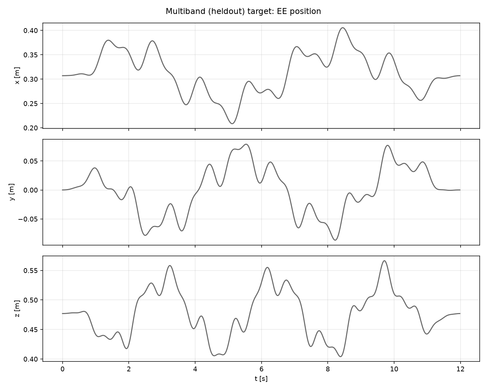
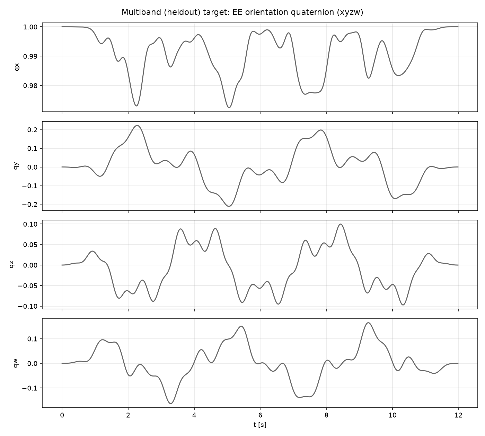
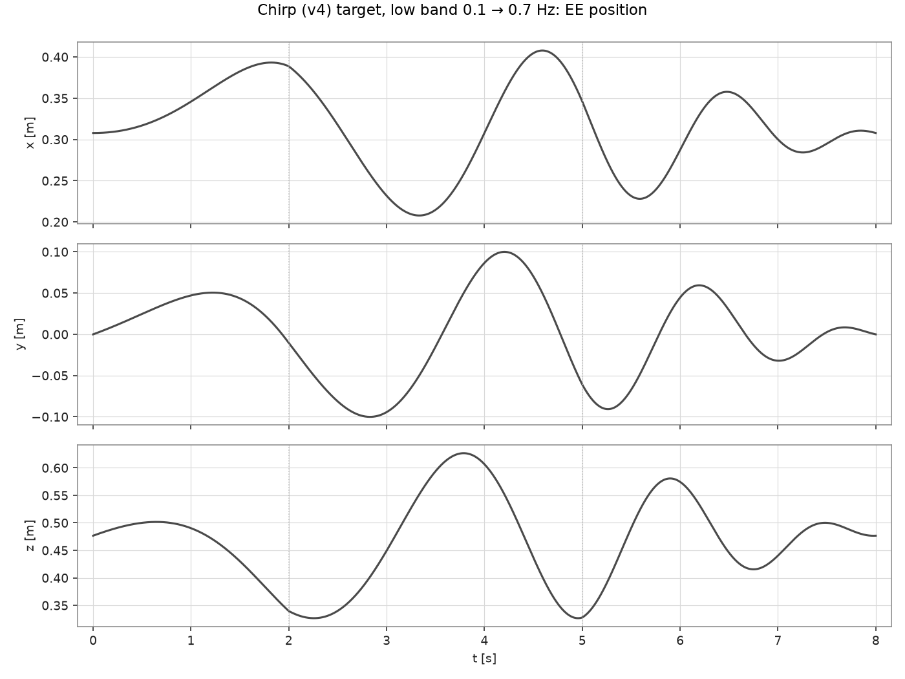
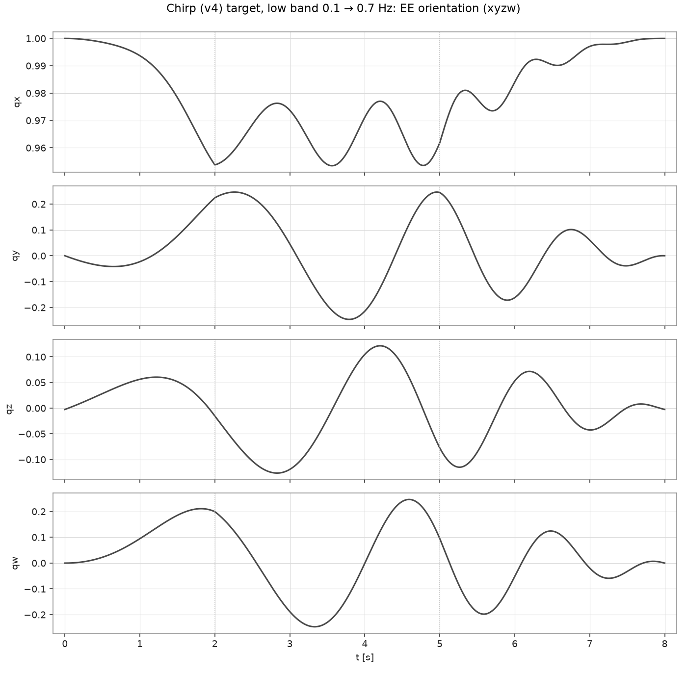
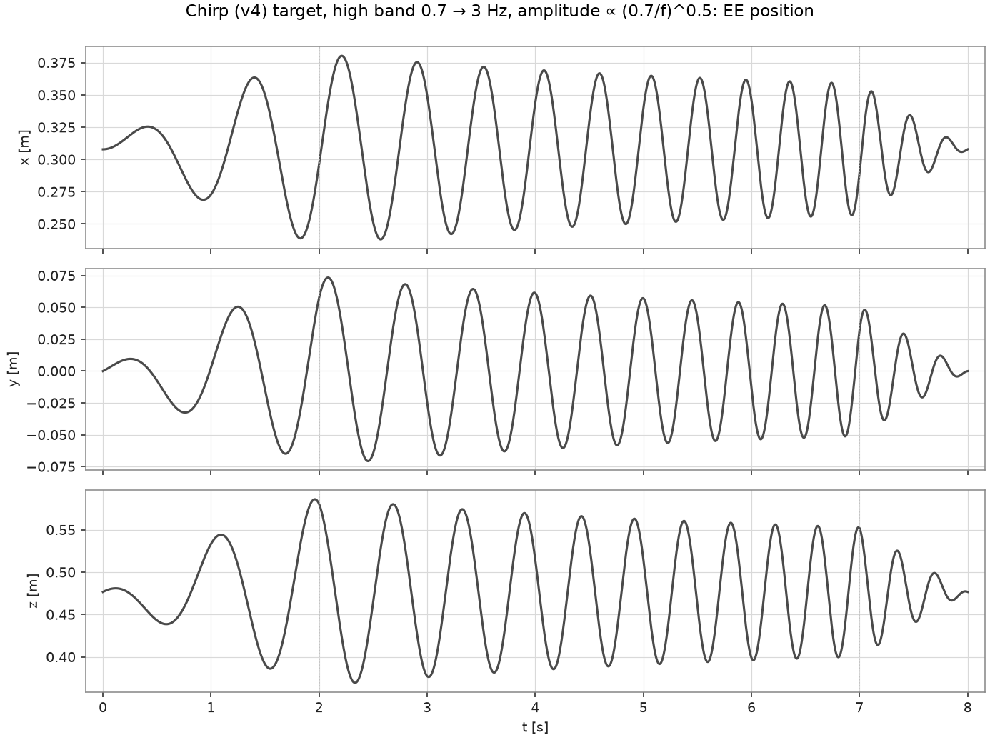
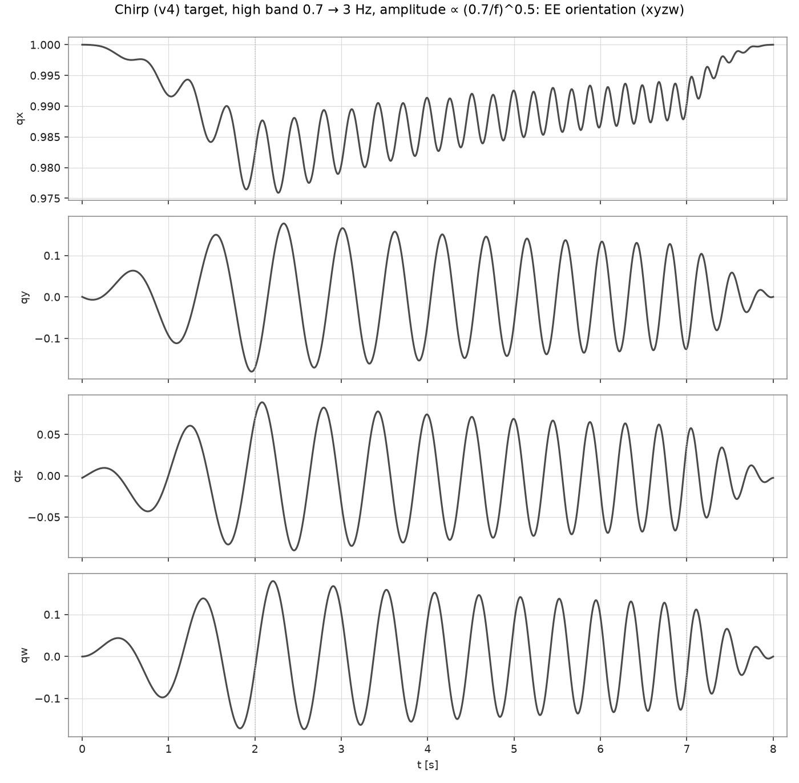

# SysID details

How the fit works and what it assumes: the procedure it follows, the 29
parameters it moves, the optimizer that moves them, and the excitations that
make them observable. The steps to actually run it are in
[System identification](sysid.md).

## Approach

We follow a procedure similar to [OmniReset](https://arxiv.org/abs/2603.15789) (UR5e),
itself based on PACE ([Bjelonic et al., 2025](https://arxiv.org/abs/2509.06342)):
record excitation runs on the real arm, replay them in sim under the same
controller, and fit friction, armature and motor delay with CMA-ES to minimize
the sim–real joint-trajectory error.

The one difference is the validation: the fitted parameters are scored on a run
the optimizer never saw and that is not a chirp at all — the `heldout`
multiband, recorded at stiffer gains than the fit. How the excitations are
shaped, and why the chirp is split into two bands, is in
[Excitation design](#excitation-design).

## What is identified

29 parameters, all per joint except the last:

| parameter | count | IsaacLab hook | bounds (default CLI) |
|---|---|---|---|
| armature (reflected rotor inertia) | 7 | `write_joint_armature_to_sim` | 0 – 0.5 kg·m² |
| μ_static | 7 | `write_joint_friction_coefficient_to_sim(static)` | 0 – 5 N·m |
| dynamic ratio (μ_dynamic = ratio · μ_static) | 7 | `… (dynamic)` | 0 – 1 |
| μ_viscous | 7 | `… (viscous)` | 0 – 5 N·m·s/rad |
| motor delay | 1 | `DelayedPDActuator` lag buffers (pos/vel/effort) | 0 – 4 ticks |

Everything else — link masses/inertias, kinematics, the controller — is taken as
known. Gravity is disabled on the sim articulation, mirroring libfranka's
gravity compensation on the real side.

The control *law* is indeed the same on both sides — `τ = Jᵀ F`, pure task-space
PD (`control_mode="task_impedance"` in
`isaaclab_sysid/.../franka_sysid/control.py`). The Jacobian in it is not
obtained the same way:

- **Real** (`src/osc_shm.cpp`):
  libfranka's analytic model, `model.zeroJacobian(Frame::kEndEffector)`, about
  the EE frame configured in Desk — the same frame the pose is read from.
- **Sim** (`franka_replay_env.py`): PhysX body Jacobians from
  `root_physx_view.get_jacobians()`, averaged over `panda_leftfinger` and
  `panda_rightfinger`, while the pose and velocity are read from a third body,
  `panda_fingertip_centered`.

So `J` differs between the two in both its source and its reference point.
CMA-ES absorbs that mismatch into the friction, armature and delay it fits — the
identified parameters therefore carry some geometric error that does not belong
to the joint dynamics at all.

## Optimizer

The fit runs [CMA-ES](https://github.com/CyberAgentAILab/cmaes) in
`isaaclab_sysid/scripts/tools/sysid_franka_osc.py`, with the 29 parameters
normalized to `[0, 1]` within the bounds above. Each generation evaluates
`--num_envs` candidates on every run at once: each run gets its own block of
`--num_envs` envs (the sim holds `num_envs × runs` envs), started from the run's
`q_init` and driven with the run's gains from its sidecar, and env `i` of every
block uses candidate `i`. The blocks replay on the same zero-order-hold time
base as `replay_python_csv_sim.py` — a 50-tick warmup, then each 50 Hz setpoint
held for its 20 × 1 ms ticks — and each candidate is scored at the CSV sample
instants with

```
loss = w_q · MSE(q_sim − q_real) + w_dq · MSE(q̇_sim − q̇_real) + w_x · MSE(x_sim − x_real)
       (w_q = 1.0, w_dq = 0.1, w_x = 0.01 by default)
```

summed over trajectories with the weights of `--traj_weights` (default 1.0
each). The loss is a raw MSE, so a run counts in proportion to how far the arm
moves in it; the high chirp band, which sweeps above the loop bandwidth and
moves the arm far less than the low band, is nearly invisible next to it at
equal weights. A fit on several runs prints what each run adds to the best
candidate's total (`w*L of best`): raise the weight of the run that stays
behind and refit.

512 envs × 40 iterations take about 1 h on an RTX 5090; the cost of a 1 kHz
tick barely depends on the env count, so a larger population is nearly free. The best parameters so far are
saved every `--save_interval` generations to
`logs/sysid_franka/<timestamp>/checkpoint_<iter>.json`, and the final result to
`logs/sysid_franka/<timestamp>/sysid_best_params.json`.

`--eval_params <file>` skips the optimizer and rolls out one parameter set (a
`sysid_best_params.json` or a checkpoint) on the given runs: it prints the loss
per run and writes `eval_rollout_<run>.csv` and `eval_result.json`.

## Excitation design

A parameter is identifiable only if the recorded motion exercises it. Two
designs ship:

| | **multiband** (`python scripts/gen_excitation_traj.py` / `python examples/cart_impedance.py --mode multiband`) | **chirp** (`python scripts/gen_chirp_traj.py` / `python examples/cart_impedance.py --mode chirp`) |
|---|---|---|
| Spectrum | three stationary tones per axis (0.15–0.30, 0.55–1.1 and 1.25–2.0 Hz), a tone at f having 0.35/f of the amplitude above 0.35 Hz | linear sweep on every axis, two bands: `--band low` 0.1 → 0.7 Hz at constant amplitude, `--band high` 0.7 → 3 Hz with the amplitude ∝ (0.7/f)^0.5 |
| Active DOF | x, y, z, rx, ry (tilt about world x / y) + base-yaw | x, y, z, rx, ry, rz, π/3 phase-staggered |
| Amplitude (of the lowest tone) | 6 / 6 / 6 cm; 0.20 / 0.15 rad of tilt, 0.25 rad of yaw | 10 / 10 / 15 cm; 0.50 / 0.25 / 0.50 rad — the high band has these at 0.7 Hz and tapers to 48 / 48 / 72 mm; 242 / 121 / 242 mrad at 3 Hz |
| Envelope | 2 s half-cosine fade-in and fade-out | linear: 2 s up / 3 s down (low band), 2 s up / 1 s down (high band) |
| Duration | 12 s | 8 s per band |
| Gains | `kp 500 / 30` — the validation run | `kp 200 / 20` — the low band is the fit run, the high band an optional held-out run (sized for these gains) |

Design notes:

- **Excite rotation.** Translation alone barely moves j1 (base yaw) and j5
  (wrist roll), leaving their friction unobservable. Adding yaw and roll to an
  earlier position-only excitation cut the sim–real RMS error from 88 to 39 mrad
  on j1 and from 29.5 to 10.1 mrad on j5.
- **The wrist caps a constant-amplitude chirp at 0.7 Hz; the high band tapers
  instead.** The single 0.1 → 3 Hz constant-amplitude sweep of the original
  UR5e / OmniReset design exceeds the 12 N·m limit of j5–j7 here and trips the
  tracking abort, so the low band stops at 0.7 Hz, where peak end-effector
  speed stays near 0.46 m/s. The high band continues to 3 Hz with the amplitude
  tapered as (0.7/f)^0.5 and a 1 s fade-out, so the upper third of the sweep
  runs at full envelope. It is sized for the fit gains kp 200/20, from an earlier
  run on the arm with taper exponent 1 and a 3 s fade-out:

  - The arm followed 0.44 / 0.20 / 0.11 of the z reference at 1.4 / 2.0 /
    2.6 Hz. A 1-DOF model of the impedance loop (kd = 2√kp, 50 Hz zero-order
    hold) reproduces that roll-off with an effective mass of about 7.5 kg, i.e.
    a loop bandwidth √(kp/m)/2π of about 0.8 Hz at kp 200 (1.3 Hz at kp 500).
    The whole band lies above it: the motion falls as reference / f², and the
    load is set by the loop, not by the reference acceleration.
  - That left 34 / 11 / 2.8 mm of z motion around 2.5 / 4.5 / 6.5 s and
    0.6–5 mrad per joint in the last window — too little to constrain anything,
    since the loss only scores motion — at a wrist load of 13 / 23 / 5 % of the
    limit (`tau_J_limit_frac`, gravity included).

  The model, calibrated on that run (z axis, kp 200; the first row is the run
  itself, measured 34 / 11 / 2.8 mm):

  | taper exponent p, fade-out | reference at 3 Hz (z) | z motion around 2.5 / 4.5 / 6.5 s | peak force | torque step per 50 Hz setpoint |
  |---|---|---|---|---|
  | 1, 3 s (the run) | 35 mm | 43 / 11 / 3.3 mm | 24 N | ≈ 0.8 N·m |
  | **0.5, 1 s (default)** | 72 mm | 60 / 19 / 10 mm | 33 N | ≈ 1.6 N·m |
  | 0, 1 s (constant amplitude, OmniReset) | 150 mm | 83 / 31 / 18 mm | 44 N | ≈ 3.1 N·m |
  | 2, 3 s (constant reference acceleration) | 8 mm | — | 14 N | — |

  The default's motion and force are the model's numbers; the run since made
  with it (kp 200/20, the `chirp_high_fit` run of the documented workflow)
  completed without an abort with the wrist at 14 / 27 / 5 % of its limit on
  j5–j7, where the model had put it near 30 %. The last column is why the
  default stops short of constant amplitude. Each
  50 Hz setpoint is a step in commanded torque; `osc_shm` ramps any step above
  0.8 N·m per tick (its 800 N·m/s slew limit), and the sim models neither that
  limit nor the 87 / 12 N·m clamp (it clamps at 100). At exponent 0 every
  setpoint would be followed by a ramp of about 4 ms that the sim does not have
  — the size of the whole 0–4 ms range the motor delay is searched in — and the
  fit would absorb it into delay and armature, the two parameters the high band
  is most sensitive to. At kp 500/30 the arm follows further up the band and the model
  puts the default at about 84 N: use `--amp-taper-exp 2` there (about 30 N;
  the script warns).
- **Replay at the logged rate.** Targets are sent at 50 Hz and held by the
  1 kHz controller; `replay_python_csv_sim.py` reproduces that hold, so the hold
  itself adds no sim–real mismatch. What does is the state in each 50 Hz row: it
  is the newest frame of the daemon's 100 Hz stream, hence 0–10 ms older than
  the row's nominal `t_s` — larger than the 0–4 ms motor delay the fit looks
  for. `--log-1khz` removes that: same setpoints at 50 Hz, but every controller
  tick recorded and each setpoint stamped by the tick it took effect
  ([Data format](data_format.md#ring-log)). Never replay a 50 Hz log
  through a 1 kHz path.
- **Hold the high band out.** The fit sees the low band alone; the high band,
  the same design continued above the loop bandwidth, is an optional held-out
  run that checks how the identified armature and delay extrapolate — or a
  second fit run, if the identified dynamics should hold up better on
  high-acceleration motion.
- **Validate on another waveform.** A held-out chirp would share its waveform
  with the fit data: one frequency at a time, every axis at the same frequency. The
  `heldout` multiband puts all its tones in at once, a different frequency on
  every axis, over the same six DOFs and inside the fitted range (0.15–2 Hz
  against 0.1–3 Hz). Three choices make it a fair check of a chirp fit:

  - *Tilt.* Rotations about world x and y move the tool axis up to 20° off
    vertical, so j5 / j6 are exercised by commanded motion, not only by
    tracking error. Roll is off: with the tool pointing down it is the same
    rotation as yaw.
  - *Spectrum.* Tone amplitudes ∝ 0.35/f (constant peak reference velocity
    above the corner), so the upper two tones carry 12–33 % of the
    reference's position power, depending on the axis — enough for the error
    on them to score armature, not friction alone.
  - *Fade-out.* It ends at the start pose.

  The profile has since run on the arm at kp 500/30, and is the held-out
  validation run behind [Our results](sysid.md#our-results). It runs at those
  gains rather than the fit's 200/20 because what limits its upper tones is the
  loop bandwidth measured above, not the reference.

### Target trajectories

#### Multiband





Three tones per axis under a 2 s half-cosine fade-in and fade-out, so the target
starts and ends at the start pose. qz and qw move (±0.10 and ±0.16): they
are the tilt about world x and y. The target orientation is
yaw(t) about world z, applied after the tilt by the world-frame axis-angle
vector (rx(t), ry(t), 0), applied to the start orientation.

#### Chirp, low band





The envelope fades in over 2 s and out over 3 s, so the target ends at the start
pose. The kinks at 2 s and 5 s are the corners of that linear envelope; since
the fade-out coincides with the highest frequencies, the peak reference
acceleration (1.3 m/s² on z) stays well below what the amplitudes would give at
0.7 Hz.

#### Chirp, high band





0.7 → 3 Hz with a 1 s fade-out, so the envelope stays at full amplitude from
2 s to 7 s. The (0.7/f)^0.5 taper shrinks the excursion as the sweep climbs —
11 cm on z at 2 s (1.3 Hz), 9 cm at 5 s (2.1 Hz), 7.5 cm at 7 s (2.7 Hz); the
orientation stays within 0.44 rad of the anchor. The reference is much faster
than the arm: above the loop's bandwidth it follows only a fraction of it.
